---

Project Organization
------------

    ├── LICENSE
    ├── README.md          <- The top-level README for developers using this project.
    ├── data
    │   ├── processed      <- The final, canonical data sets.
    │   ├── staging        <- Intermediate data that has been transformed.
    │   └── raw            <- The original MLA_100k_checked_v3.jsonlines.
    │
    ├── models             <- Trained and serialized models, model predictions, or model summaries.
    │
    ├── notebooks          <- Jupyter notebooks with steps for training and evaluating models.
    │
    ├── reports            <- Generated analysis as HTML, PDF, LaTeX, etc.
    │   └── figures        <- Generated graphics and figures to be used in reporting
    │
    └── requirements.txt   <- The requirements file for reproducing the analysis environment, e.g.

--------

MeLi Code Exercise
==============================
# Challenge

In the context of Mercadolibre's Marketplace an algorithm is needed to predict if an item listed in the marketplace is new or used.

Your tasks involve the data analysis, designing, processing and modeling of a machine learning solution to predict if an item is new or used and then evaluate the model over held-out test data.

To assist in that task a dataset is provided in `MLA_100k_checked_v3.jsonlines` and a function `build_dataset()` to read that dataset in `new_or_used.py`.

For the evaluation, you will use the accuracy metric in order to get a result of 0.86 as minimum. Additionally, you will have to choose an appropriate secondary metric and also elaborate an argument on why that metric was chosen.

- The file, including all the code needed to define and evaluate a model.
- A document with an explanation on the criteria applied to choose the features, the proposed secondary metric and the performance achieved on that metrics. 
- (Optional) EDA analysis with other format like .ipynb

--------
# **Predicting Item Condition in Marketplace**
In the context of binary classification, the variable `condition` originally had two categories, `new` and `used`. It has been redefined as a boolean variable named `is_used`, where it is True when the product is new and False otherwise. The prediction task is not directly about the `is_used` label, but rather about the probability of an item being used. The final classification is determined by analyzing the ROC curve for each model and selecting an appropriate threshold.

## Model Selection 
Five models were considered for this task:

1. Logistic Regression
2. Random Forest
3. XGBoost
4. Neural Network
5. Soft Voting Ensemble (combining the previous four models)

## Evaluation Metrics

In computing the evaluation metrics, four classification cases are established:

- True Positives (TP): Instances correctly classified as "new".
- True Negatives (TN): Instances correctly classified as "used".
- False Positives (FP): Instances incorrectly classified as "new".
- False Negatives (FN): Instances incorrectly classified as "used".

These classification cases form the basis for assessing the performance of the models in predicting item conditions within the marketplace.

**Accuracy:** it will be the primary evaluation metric, as required by the task, measures the proportion of correct predictions overall. It indicates the model's ability to correctly classify items as new or used.

In the context of our project, accuracy can be interpreted as the percentage of items correctly identified as either new or used. A higher accuracy implies that the model is making more correct predictions.

$$Accuracy = \frac{{TP + TN}}{{TP + TN + FP + FN}}$$

**F1 score:** is another crucial metric that provides a balance between precision and recall. In our project, F1 score serves as a complementary metric to accuracy. While accuracy is important, it may not be the best metric when classes are imbalanced. F1 score considers both false positives and false negatives, making it suitable for evaluating models in scenarios where the class distribution is uneven. This balanced evaluation is particularly crucial for our project, where we observed slight class imbalances within the dataset.

In our project, the F1 score represents how well the model balances correctly identifying both new and used items, while also considering false positives and false negatives.

$$F1 Score = 2 \times \frac{{Precision \times Recall}}{{Precision + Recall}}$$

**AUC:** 
The Area Under the Curve (AUC) is a metric commonly used to evaluate the performance of classification models by summarizing their performance across various threshold settings. A higher AUC indicates better discrimination between positive and negative classes, with a perfect classifier achieving an AUC of 1.0.

In our project, AUC will be used as an auxiliary measure to compare the performance of different models. By examining the AUC values for each model, we can assess their ability to distinguish between new and used items, aiding in the selection of the most effective model for our marketplace classification task.

### Auxiliary Evaluation Metrics
Given the ambiguity regarding the equivalence of misclassification costs between labeling a new item as used and vice versa, it's necessary to evaluate both scenarios independently. This highlights the importance of utilizing auxiliary metrics to comprehensively assess the model's performance. Metrics such as Precision, Sensitivity, NPV, and Specificity provide insights into the model's ability to handle each classification case effectively. Such an approach ensures a more nuanced evaluation, facilitating informed decisions regarding the model's suitability for deployment within the marketplace context.

**Precision:** measures the proportion of true positive predictions among all positive predictions made by the model. It indicates the model's ability to accurately classify items, especially in scenarios where misclassifying an item as new when it is actually used can have significant consequences.

In the context of our project, precision can be interpreted as the percentage of items identified as new that are actually new. A higher precision implies that the model is making fewer false positive predictions, ensuring that the items classified as new are indeed new.

$$Precision = \frac{{TP}}{{TP + FP}} $$

**NPV (Negative Predictive Value):** assesses the proportion of true negative predictions among all negative predictions made by the model. It indicates the model's ability to accurately classify items, particularly in scenarios where misclassifying an item as used when it is actually new can have significant consequences.

In the context of our project, NPV can be interpreted as the percentage of items identified as used that are actually used. A higher NPV implies that the model is making fewer false negative predictions, ensuring that the items classified as used are indeed used.

$$NPV = \frac{{TN}}{{TN + FN}}$$

**Sensitivity (True Positive Rate):** measures the proportion of true positive predictions among all actual positive instances. It indicates the model's ability to correctly identify items as new when they are actually new.

In the context of our project, sensitivity can be interpreted as the percentage of actual new items that are correctly identified as new by the model. A higher sensitivity implies that the model is better at capturing true new items, minimizing the number of false negatives.

$$Sensitivity = \frac{{TP}}{{TP + FN}}$$

**Specificity (True Negative Rate):** measures the proportion of true negative predictions among all actual negative instances. It indicates the model's ability to correctly identify items as used when they are actually used.

In the context of our project, specificity can be interpreted as the percentage of actual used items that are correctly identified as used by the model. A higher specificity implies that the model is better at capturing true used items, minimizing the number of false positives.

$$Specificity = \frac{{TN}}{{TN + FP}}$$

# Results

# Areas for Future Development
Within our project, we have identified several areas for improvement and alternative approaches to address the underlying challenge. These opportunities encompass potential enhancements in methodologies, explorations of additional data sources, and the consideration of alternative modeling techniques. Regrettably, due to the constraints imposed by time and resources, these avenues were not pursued. Nevertheless, recognizing their potential significance, we acknowledge them as avenues for future exploration and refinement.

# Workflow 
Here is the workflow for our project, outlining the systematic approach taken to predict whether marketplace items are new or used. This encompasses stages such as data preprocessing, feature engineering, model selection and evaluation. Each stage contributes to the development of a reliable machine learning solution, ensuring accuracy and interpretability in categorizing marketplace items.
# 1. Load Data

```python
import random
import pandas as pd
from src.features.new_or_used import build_dataset
X_train, y_train, X_test, y_test = build_dataset()
```

```python
# Convert it into dataframes for easier manipulation.
X_train = pd.DataFrame(X_train)
X_test = pd.DataFrame(X_test)
y_train = pd.DataFrame(y_train)
y_test = pd.DataFrame(y_test)
```
--------
```python
# Evaluate if there are unique columns in the training and evaluation dataframes.
train_columns = set(X_train.columns)
test_columns = set(X_test.columns)

print("Number of training columns:\t", len(train_columns))
print("Number of test columns:\t\t", len(test_columns))

train_columns_unique = train_columns - test_columns

print(f"Unique training columns.: {train_columns_unique}")
```

*Output:*
```
Number of training columns:	 45
Number of test columns:		 44
Unique training columns.: {'condition'}
```
--------

```python
# Rename variable for easier workflow.
df = X_train
```
# 2. Data Preprocessing 

```python
def categorize_data_types(df):
    """
    Categorize data types present in each column of the DataFrame into 'basic_types' and 'others'.

    Args:
    - df: pandas DataFrame containing the data.

    Returns:
    - pandas DataFrame: A DataFrame where each row represents a column of the original DataFrame.
                        It contains two columns: 'basic_types' and 'others', which record the data types found in each column.
    """
    types_df = pd.DataFrame(columns=['basic_types', 'others'])

    for column in df.columns:
        types = set(df[column].apply(lambda x: type(x).__name__))
        
        basic_types = {t for t in types if t in ['bool','int', 'float', 'str', 'list', 'tuple', 'dict', 'NoneType']}
        other_types = types - basic_types
        
        types_df.loc[column] = [', '.join(basic_types), ', '.join(other_types)]

    return types_df
```

```python
# We obtain the types of objects present in each column of the dataframe.
types_df = categorize_data_types(df)
```

First, we will focus on working with columns composed of iterable types, as these can be unpacked into multiple lists, thus facilitating data manipulation.

## 2.1 Unpack dictonary columns
```python
def column_unique_keys(column, in_list=False):
    """
    Return a set of unique keys present in the dictionaries within the specified column, including None.
    If in_list is True, the column is assumed to contain a list of dictionaries.

    Args:
    - column: pandas Series or list containing dictionaries or None.
    - in_list (optional): Boolean flag indicating if the column contains a list of dictionaries. Default is False.

    Returns:
    - set: A set containing unique keys present in the dictionaries within the column, including None.
    """
    unique_keys = set()
    if not in_list:
        for item in column:
            if item is not None:
                unique_keys.update(item.keys())
    else:
        for lst in column:
            if lst is not None:
                for item in lst:
                    if item is not None:
                        unique_keys.update(item.keys())
    return unique_keys
```
--------
```python
# Retrieve the columns with dictionary values.
columns_w_dict = types_df[types_df['basic_types'].str.contains("dict")].index.tolist()
print(f"dict columns:\t",columns_w_dict)
```
*Output:*
```
dict columns:	 ['seller_address', 'shipping']
```
--------
### 2.1.1 seller_address
--------
```python
# Retrieve all the unique keys present in the dictionaries within the column 'seller_address'
print(f"Unique keys in seller_address: {column_unique_keys(df['seller_address'])}")
```
*Output:*
```
Unique keys in seller_address: {'country', 'city', 'state'}
```
--------
```python
# Unpack and delete seller_address 
df['seller_country'] = df.apply(lambda x : x['seller_address']['country']['name'], axis = 1)
df['seller_state'] = df.apply(lambda x : x['seller_address']['state']['name'], axis = 1)
df['seller_city'] = df.apply(lambda x : x['seller_address']['city']['name'], axis = 1)

df = df.drop(columns=["seller_address"])
```
### 2.1.2 shipping
--------
```python
# Retrieve all the unique keys present in the dictionaries within the column 'shipping'
print(f"Unique keys in shipping: {column_unique_keys(df['shipping'])}")
```
*Output:*
```
Unique keys in shipping: {'mode', 'tags', 'free_methods', 'local_pick_up', 'free_shipping', 'methods', 'dimensions'}
```
--------

```python
# Unpack and delete shipping
df['shipping_dimensions'] = df.apply(lambda x : x['shipping'].get('dimensions', None), axis = 1)
df['free_shipping'] = df.apply(lambda x : x['shipping'].get('free_shipping', None), axis = 1)
df['local_pick_up'] = df.apply(lambda x : x['shipping'].get('local_pick_up', None), axis = 1)
df['shipping_methods'] = df.apply(lambda x : x['shipping'].get('methods', None), axis = 1) 
df['shipping_free_methods'] = df.apply(lambda x : x['shipping'].get('free_methods', None), axis = 1) 
df['shipping_mode'] = df.apply(lambda x : x['shipping'].get('mode', None), axis = 1)
df['shipping_tags'] = df.apply(lambda x : x['shipping'].get('tags', None), axis = 1) 

df = df.drop(columns=["shipping"])
```
```python
# Update the types of objects present in each column of the dataframe.
types_df = categorize_data_types(df)
```
## 2.2 Unpack list columns
--------
```python
# Retrieve the columns with list values.
columns_w_list = types_df[types_df['basic_types'].str.contains("list")].index.tolist()
print(f"list columns:\t",columns_w_list)
```
*Output:*
```
list columns:	 ['sub_status', 'deal_ids', 'non_mercado_pago_payment_methods', 'variations', 'attributes', 'tags', 'coverage_areas', 'descriptions', 'pictures', 'shipping_methods', 'shipping_free_methods', 'shipping_tags']
```
--------
```python
# The lengths of the lists within the columns as this can provide us with a better understanding of how to handle the data.
for column in columns_w_list:
    lengths = set(df[column].apply(lambda x: len(x) if isinstance(x, list) else None))
    print(f"Lengths of {column}",lengths)
```
*Output:*
```
Lengths of sub_status {0, 1}
Lengths of deal_ids {0, 1}
Lengths of non_mercado_pago_payment_methods {0, 1, 2, 3, 4, 5, 6, 7, 8, 9, 10, 11, 12}
Lengths of variations {0, 1, 2, 3, 4, 5, 6, 7, 8, 9, 10, 11, 12, 13, 14, 15, 16, 17, 18, 19, 20, 21, 22, 23, 24, 25, 30, 34, 35, 36, 42, 50}
Lengths of attributes {0, 1, 2, 3, 4, 5, 6, 7, 8, 9, 10, 11, 12, 13, 14, 15, 16, 17, 18, 19, 20, 21, 22, 23, 24, 26, 27, 29, 31, 36, 37, 38, 39, 40, 41, 42, 45, 46, 47, 48, 50, 52, 54, 63, 64, 65, 66, 67, 71, 73, 75, 77, 78, 81}
Lengths of tags {0, 1, 2}
Lengths of coverage_areas {0}
Lengths of descriptions {0, 1}
Lengths of pictures {0, 1, 2, 3, 4, 5, 6, 7, 8, 9, 10, 11, 12, 13, 14, 15, 16, 18, 19, 20, 21, 22, 23, 24, 25, 27, 28, 29, 30, 33, 34, 36}
Lengths of shipping_methods {0.0, nan}
Lengths of shipping_free_methods {1.0, 2.0, nan}
Lengths of shipping_tags {0, 1}
```
--------
### 2.2.1 coverage_areas, sub_status, deal_ids, descriptions, shipping_tags and shipping_methods

```python
# Unpack ists with a length of up to 1.
columns_to_unpack = ["coverage_areas", "sub_status", "deal_ids", "descriptions", "shipping_tags","shipping_methods"]

for column in columns_to_unpack:
    df[column] = df[column].apply(lambda x: x[0] if isinstance(x, list) and len(x) > 0 else None)
```
```python
# The 'descriptions' column contains dictionaries in string format. We need to convert them back to dictionaries for further processing.
df['descriptions'] = df['descriptions'].apply(lambda x: eval(x) if x is not None else None)
```
### 2.2.2 shipping_free_methods
--------
```python
# The 'shipping_free_methods' column is nearly empty and does not justify unpacking. 
count_column_unique_values(df["shipping_free_methods"])
```
*Output:*
```
{'None': 87311,
 "[{'rule': {'value': None, 'free_mode': 'country'}, 'id': 73328}]": 2641,
 "[{'rule': {'value': None, 'free_mode': 'country'}, 'id': 73330}]": 37,
 "[{'rule': {'value': None, 'free_mode': 'country'}, 'id': 501145}]": 6,
 "[{'rule': {'value': None, 'free_mode': 'country'}, 'id': 501146}]": 4,
 "[{'rule': {'value': None, 'free_mode': 'country'}, 'id': 73328}, {'rule': {'value': None, 'free_mode': 'country'}, 'id': 73330}]": 1}
```
--------
### 2.2.3 tags
```python
# Unpack tags in boolean columns and delete tags
unique_tags = set(item for sublist in df['tags'] for item in sublist)

for value in unique_tags:
    df[value] = df['tags'].apply(lambda x: value in x if x else False)

df = df.drop(columns=['tags'])
```
### 2.2.4 non_mercado_pago_payment_methods
--------
```python
# Retrieve all the unique keys present in the dictionaries within the column 'non_mercado_pago_payment_methods'
print(f"Unique keys in non_mercado_pago_payment_methods: {column_unique_keys(df['non_mercado_pago_payment_methods'],True)}")
```
*Output:*
```
Unique keys in non_mercado_pago_payment_methods: {'id', 'type', 'description'}
```
--------
```python
# Unpack non_mercado_pago_payment_methods in boolean columns and delete non_mercado_pago_payment_methods
unique_payments = set(item for sublist in df['non_mercado_pago_payment_methods'] for item in sublist)

for value in unique_payments:
    df[value] = df['non_mercado_pago_payment_methods'].apply(lambda x: value in x if x else False)

df = df.drop(columns=['non_mercado_pago_payment_methods'])
```
### 2.2.5 pictures
--------
```python
# Retrieve all the unique keys present in the dictionaries within the column 'pictures'
print(f"Unique keys in pictures: {column_unique_keys(df['pictures'],True)}")
```
*Output:*
```
Unique keys in pictures: {'max_size', 'quality', 'size', 'secure_url', 'url', 'id'}
```
--------
```python
# Get the number of pictures of the product.
df['num_pictures']  = df['pictures'].apply(lambda x: len(x) if isinstance(x, list) else None)
```
```python
# Delete pictures. None of the keys present in the dictionaries seem to contain relevant information, and several of them are devoid of any data.
df = df.drop(columns=["pictures"])
```
### 2.2.6 variations
--------
```python
# Retrieve all the unique keys present in the dictionaries within the column 'variations'
print(f"Unique keys in variations: {column_unique_keys(df['variations'],True)}")
```
*Output:*
```
Unique keys in variations: {'price', 'attribute_combinations', 'seller_custom_field', 'available_quantity', 'sold_quantity', 'picture_ids', 'id'}
```
--------
```python
# Delete variations. Seems to contain irrelevant information, with the majority of its data being represented by None values.
df = df.drop(columns=["variations"])
```

### 2.2.7 attributes
--------
```python
# Retrieve all the unique keys present in the dictionaries within the column 'attributes'
print(f"Unique keys in attributes: {column_unique_keys(X_train['attributes'],True)}")
```
*Output:*
```
Unique keys in attributes: {'value_name', 'value_id', 'attribute_group_name', 'attribute_group_id', 'name', 'id'}
```
--------
```python
# Delete attributes. seems to contain irrelevant information, with the majority of its data being represented by None values.
df = df.drop(columns=["attributes"])
```
## 2.3 Empty columns
```python
# Update the types of objects present in each column of the dataframe.
types_df = categorize_data_types(df)
```
```python
def preprocess_str_columns(df, columns):
    """
    Preprocess specified columns in a DataFrame.

    Args:
    - df (DataFrame): The DataFrame containing the columns to preprocess.
    - columns (list): A list of column names to preprocess.

    Returns:
    - DataFrame: The DataFrame with the specified columns preprocessed.
    """

    for col in columns:
        df[col] = df[col].apply(lambda x: None if x is None or (isinstance(x, str) and x.strip() == "") else x)

        df[col] = df[col].apply(lambda x: float(x) if isinstance(x, str) and x.replace(".", "", 1).isdigit() else x)

        df[col] = df[col].apply(lambda x: int(float(x)) if isinstance(x, str) and x.replace(".", "", 1).isdigit() and float(x) == int(float(x)) else x)
```
--------
```python
# Analysis of string-composed columns to detect empty strings, those solely comprising spaces, or numeric strings, aiming to enhance data usability through transformation
columns_w_str = types_df[types_df['basic_types'].str.contains("str")].index.tolist()
preprocess_str_columns(df, columns_w_str)
print(f"str columns:\t",columns_w_str)
```
*Output:*
```
str columns:	 ['warranty', 'sub_status', 'condition', 'deal_ids', 'site_id', 'listing_type_id', 'buying_mode', 'listing_source', 'parent_item_id', 'category_id', 'last_updated', 'international_delivery_mode', 'id', 'currency_id', 'thumbnail', 'title', 'date_created', 'secure_thumbnail', 'status', 'video_id', 'permalink', 'seller_country', 'seller_state', 'seller_city', 'shipping_dimensions', 'shipping_mode', 'shipping_tags']
```
--------
```python
# Get columns with missing data
missing_table = missing_values_table(df)
empty_columns = missing_table.index.tolist()
missing_table
```
*Output:*
```
| Missing Values           | % of Total Values | Data Type |
|--------------------------|-------------------|-----------|
| subtitle                 | 90000             | object    |
| listing_source           | 90000             | object    |
| coverage_areas           | 90000             | object    |
| shipping_methods         | 90000             | object    |
| differential_pricing     | 90000             | object    |
| catalog_product_id       | 89993             | float64   |
| shipping_dimensions      | 89978             | object    |
| shipping_tags            | 89941             | object    |
| original_price           | 89870             | float64   |
| deal_ids                 | 89783             | object    |
| official_store_id        | 89255             | float64   |
| sub_status               | 89109             | object    |
| video_id                 | 87324             | object    |
| shipping_free_methods    | 87311             | object    |
| warranty                 | 54786             | object    |
| parent_item_id           | 20690             | object    |
| descriptions             | 2417              | object    |
| thumbnail                | 703               | object    |
| secure_thumbnail         | 703               | object    |
| seller_country           | 1                 | object    |
| seller_state             | 1                 | object    |
| seller_city              | 2                 | object    |
```
--------
```python
# The 'warranty', 'parent_item_id' and 'descriptions' columns will be evaluated further later on, while the rest of the columns will be removed due to their high percentage of missing values
empty_columns_exceptions = ["warranty", "parent_item_id", "descriptions", "thumbnail", "secure_thumbnail", "seller_country", "seller_state", "seller_city"]

for column in empty_columns_exceptions:
    empty_columns.remove(column)

print(f"Columns to remove due to high count of missing data: {empty_columns}")
print(f"Columns to be analyzed due to the presence of missing data: {empty_columns_exceptions}")

for column in empty_columns:
    df = df.drop(columns=[column])
```
*Output:*
```
Columns to remove due to high count of missing data: ['subtitle', 'listing_source', 'coverage_areas', 'shipping_methods', 'differential_pricing', 'catalog_product_id', 'shipping_dimensions', 'shipping_tags', 'original_price', 'deal_ids', 'official_store_id', 'sub_status', 'video_id', 'shipping_free_methods']
Columns to be analyzed due to the presence of missing data: ['warranty', 'parent_item_id', 'descriptions', 'thumbnail', 'secure_thumbnail', 'seller_country', 'seller_state', 'seller_city']
```
--------
### 2.3.1 Columns with missing data 
```python
# The 'warranty', 'parent_item_id' and 'descriptions' columns will be evaluated further later on, while the rest of the columns will be removed due to their high percentage of missing values
empty_columns_exceptions = ["warranty", "parent_item_id", "descriptions", "thumbnail", "secure_thumbnail", "seller_country", "seller_state", "seller_city"]

for column in empty_columns_exceptions:
    empty_columns.remove(column)

print(f"Columns to remove due to high count of missing data: {empty_columns}")
print(f"Columns to be analyzed due to the presence of missing data: {empty_columns_exceptions}")

for column in empty_columns:
    df = df.drop(columns=[column])
```
### 2.3.2 descriptions
--------
```python
# Retrieve all the unique keys present in the dictionaries within the column 'descriptions'
print(f"Unique keys in descriptions: {column_unique_keys(df['descriptions'])}")
```
*Output:*
```
Unique keys in descriptions: {'id'}
```
--------
```python
# Compare the information stored in the 'descriptions' column with that stored in the 'id' column.
random_row = random.randint(0, df.shape[0])
print(f"Information for row {random_row} in column id: {df['id'].iloc[random_row]}, and in column descriptions: {df['descriptions'].iloc[random_row]['id']}")
```
*Output:*
```
Information for row 50198 in column id: MLA1923708022, and in column descriptions: MLA1923708022-906724134
```
--------
```python
# Considering the high similarity between the information in descriptions and that in id, descriptions is removed to avoid redundancy and streamline the dataset.
df = df.drop(columns=['descriptions'])
```
### 2.3.3 warranty
--------
```python
# Extract the unique values from the column 'warranty'
print(f"Number of unique values: {len(df['warranty'].value_counts())}")
```
*Output:*
```
Number of unique values: 9535
```
--------
Given its extensive range of categories and considerable missing data, the decision has been made to discard this column. The creation of the new column "warranty_info" serves to distill complex warranty information into a simplified binary variable, capturing whether any warranty details are provided. This transformation streamlines the feature space while retaining crucial insights about the presence or absence of warranty information. Moreover, it acknowledges the tendency for new items to frequently disclose warranty duration or status, contrasting with the relatively rare occurrence of warranty information for used products.


```python
# Create 'warranty_info' and delete 'warranty'
df['warranty_info'] = df['warranty'].apply(lambda x: True if x is not None else False)
df = df.drop(columns=["warranty"])
```
Now that we've handled columns containing lists and dictionaries, as well as empty columns, let's shift our attention to columns composed of basic Python types, we will work with groups of related columns.
## 2.4 Address columns
--------
```python
# Obtain the count of unique values for each column.
address_columns = ["seller_country", "seller_state", "seller_city"]

for column in address_columns:
    print(f"Unique values of {column}: {len(df[column].unique())}")
```
*Output:*
```
Unique values of seller_country: 2
Unique values of seller_state: 25
Unique values of seller_city: 3480
```
--------
```python
# Get the 'seller_country' value counts
df["seller_country"].value_counts()
```
*Output:*
```
Argentina    89999
Name: seller_country, dtype: int64
```
--------
```python
# Get the 'seller_country' value counts
df["seller_state"].value_counts()
```
*Output:*
```
Capital Federal        52143
Buenos Aires           31482
Santa Fe                2398
Córdoba                 1727
Mendoza                  400
Chubut                   335
Entre Ríos               249
Tucumán                  214
San Juan                 132
Salta                    131
Misiones                 122
Río Negro                119
Corrientes               110
Neuquén                   87
La Pampa                  70
Chaco                     69
San Luis                  56
Jujuy                     33
Formosa                   28
Santiago del Estero       26
Santa Cruz                22
Catamarca                 20
La Rioja                  16
Tierra del Fuego          10
Name: seller_state, dtype: int64
```
--------
Creating a new column "buenos_aires_seller" to combine sellers from Buenos Aires and the Federal Capital is justified due to their geographical proximity and socioeconomic similarities. This consolidation simplifies data analysis, ensures consistency, and facilitates meaningful comparisons. Additionally, sellers from these two regions constitute the vast majority of the dataset, making this grouping approach highly relevant and practical.
```python
# Create 'buenos_aires_seller'
df['buenos_aires_seller'] = df['seller_state'].isin(['Buenos Aires', 'Capital Federal'])
```
Given that all sellers are from Argentina, the information provided by the column seller_country is unnecessary. Furthermore, since the majority of sellers come from the Buenos Aires province or the Federal Capital, the detailed information in the seller_city column is also unnecessary, especially considering its numerous categories.
```python
# Delete 'seller_country', 'seller_state', 'seller_city'
for column in address_columns:
    df = df.drop(columns=[column])
```
## 2.5 Shipping columns

```python
shipping_columns = ["shipping_mode", "free_shipping", "local_pick_up", "international_delivery_mode"]
```
--------
```python
print(f"Number of unique clases in shipping_mode: {list(df['shipping_mode'].unique())}")
```
*Output:*
```
Number of unique clases in shipping_mode: ['not_specified', 'me2', 'custom', 'me1']
```
--------
```python
# Unpack the 'shipping_mode' column into 'shipping_not_specified', 'shipping_me2', 'shipping_custom', and 'shipping_me1'.
shipping_modes = list(df['shipping_mode'].unique())

for mode in shipping_modes:
    df[f'shipping_{mode}'] = df['shipping_mode'] == mode

df = df.drop(columns=['shipping_mode'])
```
--------
```python
# Check the values ​​present in the 'international_delivery_mode' column.
df["international_delivery_mode"].value_counts()
```
*Output:*
```
none    90000
Name: international_delivery_mode, dtype: int64
```
The 'international_delivery_mode' column has a single value, a string of 'none', so it will be removed.

--------
```python
# Delete 'international_delivery_mode'
df = df.drop(columns=['international_delivery_mode'])
```
The 'free_shipping' and 'local_pick_up' columns require no further processing.
## 2.6 Tag columns
```python
tag_columns = ['dragged_bids_and_visits','dragged_visits','free_relist','good_quality_thumbnail','poor_quality_thumbnail']
```
--------
```python
tags_true_counts = df[list(unique_tags)].sum(axis=0)
print("Number of True elements per column of tags:")
print(tags_true_counts)
```
*Output:*
```
Number of True elements per column of tags:
dragged_visits               723
good_quality_thumbnail      1537
free_relist                  259
dragged_bids_and_visits    66516
poor_quality_thumbnail        13
dtype: int64
```
--------
Given the similar nature of the 'dragged_bids_and_visits' and 'dragged_visits' columns, the information will be merged into a single column named 'dragged_bids_or_visits'
```python
# Create dragged_bids_or_visits
df["dragged_bids_or_visits"] = df["dragged_bids_and_visits"] | df["dragged_visits"]
```
Due to the low occurrence of True values in the 'good_quality_thumbnail', 'poor_quality_thumbnail', and 'free_relist' columns, they will be removed.
```python
# Delete dragged_bids_and_visits, dragged_visits, free_relist, good_quality_thumbnail, poor_quality_thumbnail
for column in tag_columns:
    df = df.drop(columns=[column])
```
## 2.7 Payment methods molumns
```python
payment_methods_columns = ['Acordar con el comprador','American Express','Cheque certificado','Contra reembolso','Diners','Efectivo','Giro postal','MasterCard','Mastercard Maestro','MercadoPago','Tarjeta de crédito','Transferencia bancaria','Visa','Visa Electron','accepts_mercadopago']
```
The payment methods were grouped as follows:

- **Agree_with_buyer_payment**: Only includes the payment method "Acordar con el comprador". This method involves agreeing on the payment directly with the buyer.
  
- **Card_payment**: Includes various credit and debit card brands such as American Express, MasterCard, Visa, etc. These methods involve payment using a credit or debit card.
  
- **Cash_payment**: Includes payment methods where cash is involved, such as "Efectivo" and "Giro postal". Also includes "Contra reembolso", which typically implies cash payment upon delivery.
  
- **Bank_payment**: Includes bank-related payment methods such as "Transferencia bancaria" and "Cheque certificado". These methods involve transferring funds between bank accounts.
  
- **Mercadopago_payment**: Specifically includes the payment method "MercadoPago".
```python
# Group the payment methods.
payment_mapping = {
    'agree_with_buyer_payment': ['Acordar con el comprador'],
    'card_payment': ['American Express', 'MasterCard', 'Mastercard Maestro', 'Tarjeta de crédito', 'Visa', 'Visa Electron', 'Diners'],
    'cash_payment': ['Efectivo', 'Giro postal', 'Contra reembolso'],
    'bank_payment': ['Transferencia bancaria', 'Cheque certificado'],
    'mercadopago_payment': ['MercadoPago']
}
for new_column, original_columns in payment_mapping.items():
    df[new_column] = df[original_columns].any(axis=1)
```
The column 'accepts_mercadopago' is conveying similar information to the previously created 'mercadopago_payment'. Therefore, the data from both columns will be merged.
```python
# Join 'accepts_mercadopago' and 'mercadopago_payment' in 'mercadopago_payment'
df["mercadopago_payment"] = df["accepts_mercadopago"] | df["mercadopago_payment"]
```
```python
# Delete payment_methods_columns
for column in payment_methods_columns:
    df = df.drop(columns=[column])
```
## 2.8 Price Columns
```python
price_columns = ["currency_id", "price", "base_price"]
```
--------
```python
# Check on the unique values present in the 'currency_id' column
df["currency_id"].value_counts()
```
*Output:*
```
ARS    89496
USD      504
Name: currency_id, dtype: int64
```
--------
The 'currency_id' column is transformed into 'price_in_usd' to indicate when the listing displays its price in USD.
```python
# Make 'price_in_usd' and 'delete currency_id'
df['price_in_usd'] = df['currency_id'].replace({'USD': True, 'ARS': False})
df = df.drop(columns=['currency_id'])
```
'price' and 'base_price' appear to have a similar nature. An evaluation will be conducted to determine if there are significant differences in their values.

--------
```python
# Check differences between 'base_price' and 'price differ'
print(f"Number of samples where base_price and price differ: {len(df[df['price'] != df['base_price']])}")
```
*Output:*
```
Number of samples where base_price and price differ: 26
```
--------
```python
# Perform data validation on 'price'
print(f"Number of inavlid values on price: {len(df[df['price']< 0])}")
```
*Output:*
```
Number of inavlid values on price: 0
```
--------
Due to the similarity between the data in 'price' and 'base_price', one of the two columns will be removed to avoid redundancy in the data.
```python
# Delete base_price
df = df.drop(columns=['base_price'])
```
## 2.9 Time columns
```python
time_columns = ['start_time', 'stop_time', 'date_created', 'last_updated']
```
```python
# Change columns to datetime object.
df['start_time'] = pd.to_datetime(df['start_time'], unit='ms')
df['stop_time'] = pd.to_datetime(df['stop_time'], unit='ms')
df['date_created'] = pd.to_datetime(df['date_created'], format='%Y-%m-%dT%H:%M:%S.%fZ')
df['last_updated'] = pd.to_datetime(df['last_updated'], format='%Y-%m-%dT%H:%M:%S.%fZ')
```
'start_time' and 'date_created' appear to have a similar nature. An evaluation will be conducted to determine if there are significant differences in their values.

--------
```python
print(f"Number of samples where start_time and date_created differ: {len(df[df['start_time'] != df['date_created']])}")
```
*Output:*
```
Number of samples where start_time and date_created differ: 18238
```
--------
Upon thorough comparison of the columns 'start_time' and 'date_created', it was found that while there are indeed differences between the two columns, these discrepancies amount to just one second. Hence, for the purposes of this analysis, both columns effectively contain the same information.

--------
```python
df.loc[df['start_time'] != df['date_created'], ['start_time', 'date_created']].head(10)
```
*Output:*
```markdown
| start_time | date_created |
|------------|--------------|
| 2015-08-30 14:24:01 | 2015-08-30 14:24:02 |
| 2015-10-03 23:11:29 | 2015-10-03 23:11:30 |
| 2015-09-30 15:05:20 | 2015-09-30 15:05:21 |
| 2015-10-14 15:02:18 | 2015-10-14 15:02:19 |
| 2015-09-25 18:02:07 | 2015-09-25 18:02:08 |
| 2015-09-23 13:47:26 | 2015-09-23 13:47:27 |
| 2015-09-17 14:15:35 | 2015-09-17 14:15:36 |
| 2015-09-25 14:48:16 | 2015-09-25 14:48:17 |
| 2015-09-21 17:08:42 | 2015-09-21 17:08:43 |
| 2015-10-12 19:57:48 | 2015-10-12 19:57:49 |

```
--------
The corresponding columns for the week number and day of the week when the offer began, and likewise for when it ended, are created. Additionally, a column is generated to calculate the number of days that elapsed from the start to the end of the offer.
```python
# Make 'start_week', 'start_day', 'stop_week', 'stop_day', 'days_active'
df['start_week'] = df['start_time'].dt.isocalendar().week
df['start_day'] = df['start_time'].dt.dayofweek
df['stop_week'] = df['stop_time'].dt.isocalendar().week
df['stop_day'] = df['stop_time'].dt.dayofweek
df['days_active'] = (df['stop_time'] - df['start_time']).dt.days
```
The columns with redundant information are removed, and it was determined that the 'last_updated' column does not provide relevant information.
```python
# Delete time columns
for column in time_columns:
    df = df.drop(columns=[column])
```
## 2.10 Quantity columns
```python
quantity_columns = ["initial_quantity", "sold_quantity", "available_quantity"]
```
An integrity check is performed on the data for 'initial_quantity', 'sold_quantity', and 'available_quantity' columns.

--------
```python
print(f"Number of inavlid values on initial_quantity: {len(df[df['initial_quantity']< 1])}")
print(f"Number of inavlid values on sold_quantity: {len(df[df['sold_quantity']< 0])}")
print(f"Number of inavlid values on available_quantity: {len(df[df['available_quantity']< 0])}")
```
*Output:*
```
Number of inavlid values on initial_quantity: 0
Number of inavlid values on sold_quantity: 0
Number of inavlid values on available_quantity: 0
```
--------
The 'initial_quantity', 'sold_quantity' and 'available_quantity' columns require no further processing.

## 2.11 Listing control columns
```python
listing_control_columns =["status", "buying_mode", "listing_type_id", "automatic_relist"]
```
Analyze the value counts of column 'status' to gain insights into its distribution and frequency of occurrence.

--------
```python
df["status"].value_counts()
```
*Output:*
```
active            86116
paused             3863
closed               20
not_yet_active        1
Name: status, dtype: int64
```
--------
The unpacking of the "status" column into the variables "is_active" "is_paused" "is_closed" of "is_not_yet_active" was not performed due to the limited amount of meaningful information it could provide.
```python
# Unpack and delete status
status_values = list(df['status'].unique())
status_values.remove("not_yet_active")
status_values.remove("paused")
status_values.remove("closed")

for status in status_values:
    df[f'is_{status}'] = df['status'] == status

df = df.drop(columns=['status'])
```
We will analyze the value counts of column 'buying_mode' to gain insights into its distribution and frequency of occurrence.

--------
```python
buying_modes = df["buying_mode"].value_counts()
buying_modes
```
*Output:*
```
buy_it_now    87311
classified     1982
auction         707
Name: buying_mode, dtype: int64
```
--------
The unpacking of the 'status' column into the variables 'buy_it_now' 'classified' and 'auction''
```python
# Unpack and delete buying_mode
buying_modes = list(df['buying_mode'].unique())
for mode in buying_modes:
    df[f'mode_{mode}'] = df['buying_mode'] == mode

df = df.drop(columns=['buying_mode'])
```
We will analyze the value counts of column 'listing_type_id' to gain insights into its distribution and frequency of occurrence.

--------
```python
df['listing_type_id'].value_counts()
```
*Output:*
```
bronze          56904
free            19260
silver           8195
gold_special     2693
gold             2170
gold_premium      765
gold_pro           13
Name: listing_type_id, dtype: int64
```
--------
The column 'listing_type_id' will be unpacked to create new columns denoting each unique category present. Specifically, the categories 'gold_special', 'gold', 'gold_premium', and 'gold_pro' have been grouped under the listing_gold column. This grouping was done as these categories generally have a limited number of individual examples, allowing for better representation and generalization in the new combined column.

```python
# Unpack and delete listing_type_id
df['listing_free'] = df['listing_type_id'] == 'free'
df['listing_bronze'] = df['listing_type_id'] == 'bronze'
df['listing_silver'] = df['listing_type_id'] == 'silver'

gold_categories = ['gold_special', 'gold', 'gold_premium', 'gold_pro']
df['listing_gold'] = df['listing_type_id'].isin(gold_categories)

df = df.drop(columns=['listing_type_id'])
```
The 'automatic_relist' column require no further processing.

## 2.12 Links columns
```python
links_columns = ["thumbnail", "secure_thumbnail", "permalink"]
```
The columns 'thumbnail', 'secure_thumbnail', 'permalink' contain only links and do not contribute to the prediction task, hence they will be removed.
```python
# Delete link columns
for column in links_columns:
    df = df.drop(columns=[column])
```
## 2.13 Id columns
```python
id_columns = ["title","seller_id","id","parent_item_id","category_id","site_id" ]
```
We will analyze the unique values of the columns 'title', 'seller_id', 'id', 'parent_item_id', 'category_id' and 'site_id' to gain insights into its distribution and frequency of occurrence.

--------
```python
for i in id_columns:
    print(f"Unique values in {i}: {len(df[i].unique())}")
```
*Output:*
```
Unique values in title: 89008
Unique values in seller_id: 33281
Unique values in id: 90000
Unique values in parent_item_id: 69311
Unique values in category_id: 10491
Unique values in site_id: 1
```
--------
All columns exhibited a large number of categories, except for site_id, which had only one unique category. Additionally, it is worth noting that seller_id values are typically assigned in the order that sellers register on the platform. Regarding other ID columns such as id, parent_item_id, category_id, and site_id, their generation function is dependent on internal policies of the company and may or may not be related to the condition of the product being new or used.

```python
# Delete id columns
for column in id_columns:
    df = df.drop(columns=[column])
```
## 2.14 Tiding up
```python
COLUMNS_ORDER = [
    # product info
    "price","price_in_usd","initial_quantity","sold_quantity","available_quantity","warranty_info",
    # buying mode
    "mode_buy_it_now","mode_classified","mode_auction",
    # payment info
    "cash_payment","card_payment","bank_payment","mercadopago_payment","agree_with_buyer_payment",
    # shipping info
    "shipping_me1","shipping_me2","shipping_custom","shipping_not_specified","free_shipping","local_pick_up",
    # seller info
    "buenos_aires_seller","listing_free","listing_bronze","listing_silver","listing_gold",
    # publication info
    "start_week","start_day","stop_week","stop_day","days_active","is_active",
    "num_pictures","automatic_relist","dragged_bids_or_visits"
    ] 
```
```python
# Organize dataframe columns
df = df.reindex(columns=COLUMNS_ORDER)
```
```python
# Transforms boolean column
bool_columns = df.select_dtypes(include=bool).columns
df[bool_columns] = df[bool_columns].astype(int)
```
An essential step forward: The function `preprocess_dataset()` has been coded and resides within `src/features/data_preprocessing.py`. This paves the way for streamlined data preprocessing in future endeavors.
# 3. Data Exploratory Analisys (DAE)

Prior to delving into the analysis, it is imperative to conduct a thorough examination of the columns, scrutinizing their respective sources and discerning the nature of their data types. This preliminary step is pivotal in laying a robust foundation for subsequent data processing and analysis, ensuring a comprehensive understanding of the dataset's composition and characteristics.

--------
<table>
  <thead>
    <tr>
      <th>Variable</th>
      <th>Data Type</th>
      <th>Source</th>
      <th>Description</th>
    </tr>
  </thead>
  <tbody>
    <tr>
      <td>price</td>
      <td>float</td>
      <td>dataset</td>
      <td>Price of the product.</td>
    </tr>
    <tr>
      <td>price_in_usd</td>
      <td>bool</td>
      <td>transformed</td>
      <td>Indicates whether the price of the product is in US dollars.</td>
    </tr>
    <tr>
      <td>initial_quantity</td>
      <td>int</td>
      <td>dataset</td>
      <td>Initial quantity of products available for sale.</td>
    </tr>
    <tr>
      <td>sold_quantity</td>
      <td>int</td>
      <td>dataset</td>
      <td>Quantity of products sold.</td>
    </tr>
    <tr>
      <td>available_quantity</td>
      <td>int</td>
      <td>dataset</td>
      <td>Current quantity of products available for sale.</td>
    </tr>
    <tr>
      <td>warranty_info</td>
      <td>bool</td>
      <td>transformed</td>
      <td>Indicates whether the seller provides information about the product warranty.</td>
    </tr>
    <tr>
      <td>mode_buy_it_now</td>
      <td>bool</td>
      <td>transformed</td>
      <td>Indicates whether the sale is made using the "Buy it now" option.</td>
    </tr>
    <tr>
      <td>mode_classified</td>
      <td>bool</td>
      <td>transformed</td>
      <td>Indicates whether the sale is made using the "Classifieds" option.</td>
    </tr>
    <tr>
      <td>mode_auction</td>
      <td>bool</td>
      <td>transformed</td>
      <td>Indicates whether the sale is made using the "Auction" option.</td>
    </tr>
    <tr>
      <td>cash_payment</td>
      <td>bool</td>
      <td>transformed</td>
      <td>Indicates whether cash or money order payment is accepted.</td>
    </tr>
    <tr>
      <td>card_payment</td>
      <td>bool</td>
      <td>transformed</td>
      <td>Indicates whether payment by credit card is accepted.</td>
    </tr>
    <tr>
      <td>bank_payment</td>
      <td>bool</td>
      <td>transformed</td>
      <td>Indicates whether payment by bank transfer or certified check is accepted.</td>
    </tr>
    <tr>
      <td>mercadopago_payment</td>
      <td>bool</td>
      <td>transformed</td>
      <td>Indicates whether payment through MercadoPago is accepted.</td>
    </tr>
    <tr>
      <td>agree_with_buyer_payment</td>
      <td>bool</td>
      <td>transformed</td>
      <td>Indicates whether the seller agrees with the buyer's payment method.</td>
    </tr>
    <tr>
      <td>shipping_me1</td>
      <td>bool</td>
      <td>transformed</td>
      <td>Indicates whether the shipping mode is "me1".</td>
    </tr>
    <tr>
      <td>shipping_me2</td>
      <td>bool</td>
      <td>transformed</td>
      <td>Indicates whether the shipping mode is "me2".</td>
    </tr>
    <tr>
      <td>shipping_custom</td>
      <td>bool</td>
      <td>transformed</td>
      <td>Indicates whether the shipping mode is "custom".</td>
    </tr>
    <tr>
      <td>shipping_not_specified</td>
      <td>bool</td>
      <td>transformed</td>
      <td>Indicates whether the shipping mode is not specified.</td>
    </tr>
    <tr>
      <td>free_shipping</td>
      <td>bool</td>
      <td>transformed</td>
      <td>Indicates whether free shipping is offered.</td>
    </tr>
    <tr>
      <td>local_pick_up</td>
      <td>bool</td>
      <td>transformed</td>
      <td>Indicates whether local pick-up is available.</td>
    </tr>
    <tr>
      <td>buenos_aires_seller</td>
      <td>bool</td>
      <td>transformed</td>
      <td>Indicates whether the seller is located in Buenos Aires.</td>
    </tr>
    <tr>
      <td>listing_free</td>
      <td>bool</td>
      <td>transformed</td>
      <td>Indicates whether the listing type is "free".</td>
    </tr>
    <tr>
      <td>listing_bronze</td>
      <td>bool</td>
      <td>transformed</td>
      <td>Indicates whether the listing type is "bronze".</td>
    </tr>
    <tr>
      <td>listing_silver</td>
      <td>bool</td>
      <td>transformed</td>
      <td>Indicates whether the listing type is "silver".</td>
    </tr>
    <tr>
      <td>listing_gold</td>
      <td>bool</td>
      <td>transformed</td>
      <td>Indicates whether the listing type is "gold", "gold_pro", "gold_premium" or "gold_special".</td>
    </tr>
    <tr>
      <td>start_week</td>
      <td>int</td>
      <td>transformed</td>
      <td>Week when the listing started.</td>
    </tr>
    <tr>
      <td>start_day</td>
      <td>int</td>
      <td>transformed</td>
      <td>Day of the week when the listing started.</td>
    </tr>
    <tr>
      <td>stop_week</td>
      <td>int</td>
      <td>transformed</td>
      <td>Week when the listing stopped.</td>
    </tr>
    <tr>
      <td>stop_day</td>
      <td>int</td>
      <td>transformed</td>
      <td>Day of the week when the listing stopped.</td>
    </tr>
    <tr>
      <td>days_active</td>
      <td>int</td>
      <td>transformed</td>
      <td>Number of days the listing was active.</td>
    </tr>
    <tr>
      <td>is_active</td>
      <td>bool</td>
      <td>transformed</td>
      <td>Indicates whether the listing is currently active.</td>
    </tr>
    <tr>
      <td>num_pictures</td>
      <td>int</td>
      <td>transformed</td>
      <td>Number of pictures included in the listing.</td>
    </tr>
    <tr>
      <td>automatic_relist</td>
      <td>bool</td>
      <td>dataset</td>
      <td>Indicates whether automatic relisting is enabled.</td>
    </tr>
    <tr>
      <td>dragged_bids_or_visits</td>
      <td>bool</td>
      <td>transformed</td>
      <td>Indicates whether the listing has been visited or bid on.</td>
    </tr>
  </tbody>
</table>

--------
The target column was transformed from 'status' to 'is_new'

<table>
  <thead>
    <tr>
      <th>Variable</th>
      <th>Data Type</th>
      <th>Source</th>
      <th>Description</th>
    </tr>
  </thead>
  <tbody>
    <tr>
      <td>is_new</td>
      <td>bool</td>
      <td>transformed</td>
      <td>Indicates whether the product is new.</td>
    </tr>
  </tbody>
</table>


## 3.1 Import Libraries and Data
```python
import pandas as pd
import numpy as np
from scipy.stats import yeojohnson
from src.features.data_process import DataScaler
```
```python
MAKE_DATASET = False
if MAKE_DATASET:
    X_train, y_train, X_test, y_test = build_dataset()

    X_train = pd.DataFrame(X_train)
    X_test = pd.DataFrame(X_test)
    y_train = pd.DataFrame(y_train)
    y_test = pd.DataFrame(y_test)

    y_train.columns = ['condition']
    y_test.columns = ['condition']

    train_data, train_target = preprocess_dataset(X_train,y_train,del_na=True)
    test_data, test_target = preprocess_dataset(X_test,y_test,del_na=True)

    train_data.to_csv("../data/staging/train_data.csv", index=False)
    train_target.to_csv("../data/staging/train_target.csv", index=False)
    test_data.to_csv("../data/staging/test_data.csv", index=False)
    test_target.to_csv("../data/staging/test_target.csv", index=False)

else:
    train_data = pd.read_csv("../data/staging/train_data.csv")
    train_target = pd.read_csv("../data/staging/train_target.csv")
    test_data = pd.read_csv("../data/staging/test_data.csv")
    test_target = pd.read_csv("../data/staging/test_target.csv")
```
```python
df = pd.concat([train_data, train_target], axis=1).copy(deep=True)
df_2 = pd.concat([test_data, test_target], axis=1).copy(deep=True)
```
## 3.2 Data Exploration Analisis (DAE)
```python
target_column = ["is_new"]
numeric_columns = ['price','initial_quantity','sold_quantity','available_quantity','days_active','num_pictures']
date_columns = ["start_week", "start_day", "stop_week", "stop_day"]
bool_columns = ['price_in_usd', 'warranty_info', 'mode_buy_it_now', 'mode_classified','mode_auction', 'cash_payment', 'card_payment', 'bank_payment','mercadopago_payment','agree_with_buyer_payment','shipping_me1','shipping_me2', 'shipping_custom', 'shipping_not_specified','free_shipping', 'local_pick_up', 'buenos_aires_seller', 'listing_free','listing_bronze', 'listing_silver','listing_gold', 'is_active', 'automatic_relist', 'dragged_bids_or_visits']
```
### 3.2.1 Bool columns

In this phase of our analysis, we embark on an examination of the distribution patterns exhibited by binary categorical variables within our dataset. The exploration of these variables serves as a crucial step in understanding the fundamental characteristics and potential insights they may provide.

```python
def create_subplots(plot_function, data, classes, num_rows, num_cols,
                    title="", title_font_size=16, fig_size=(5,5),
                    share_x = False, share_y = False,**kwargs):
    """
    Create a figure with a grid of subplots and apply a plotting function to each subplot.

    Parameters:
        plot_function (function): The function to apply to each subplot. It should accept two parameters:
                                  the subplot axis and the DataFrame for plotting.
        data (pandas.DataFrame): The DataFrame containing the data for plotting.
        classes (list): A list of class labels or identifiers.
        num_rows (int): The number of rows in the subplot grid.
        num_cols (int): The number of columns in the subplot grid.
        title (str, optional): The title for the entire figure.
        title_font_size (int, optional): The font size for the title of the entire figure.
        fig_size (tuple, optional): The size of the figure (width, height) in inches.
        **kwargs: Arbitrary keyword arguments to pass to plot_function.

    Returns:
        None

    Raises:
        ValueError: If the number of classes is greater than the number of subplots.
    """

    if len(classes) > num_rows * num_cols:
        raise ValueError("Number of classes are greater than the number of subplots.")
    
    if num_rows == 1 and num_cols == 1:
        fig, ax = plt.subplots(figsize=fig_size)
        plot_function(ax, data, classes[0], **kwargs)
        ax.set_title(title)
        plt.show()
        return

    fig, axs = plt.subplots(nrows=num_rows, ncols=num_cols, figsize=fig_size,sharex=share_x,sharey=share_y)
    if not (num_rows == 1 and num_cols == 1) and title != "":
        fig.suptitle(title, fontsize=title_font_size) 
    
    for i in range(num_rows * num_cols):
        if i < len(classes):
            row = i // num_cols
            col = i % num_cols
            if num_rows == 1:
                ax = axs[col]
            elif num_cols == 1:
                ax = axs[row]
            else:
                ax = axs[row, col]

            plot_function(ax, data, classes[i],**kwargs)
        
        else:
            fig.delaxes(axs.flat[i])
    
    fig.tight_layout()
    plt.show()
```

```python
def binary_countplot_function(ax, data, class_label, **kwargs):
    """
    Plotting function to create a countplot using Seaborn for binary categorical variables (0 or 1).

    Parameters:
        ax (matplotlib.axes.Axes): The axes object of the subplot.
        data (pandas.Series or pandas.DataFrame): The data to create the countplot.
        class_label (str): The class label or identifier associated with the data.
        **kwargs: Additional keyword arguments to pass to sns.countplot().

    Returns:
        None
    """
    sns.countplot(x=data[class_label], data=data, ax=ax, **kwargs)
    ax.set_xticklabels(['False', 'True'])
```

--------
```python
create_subplots(binary_countplot_function, df, target_column + bool_columns, num_rows=5, num_cols=5, fig_size=(20, 20),share_y=True)
```
*Output:*

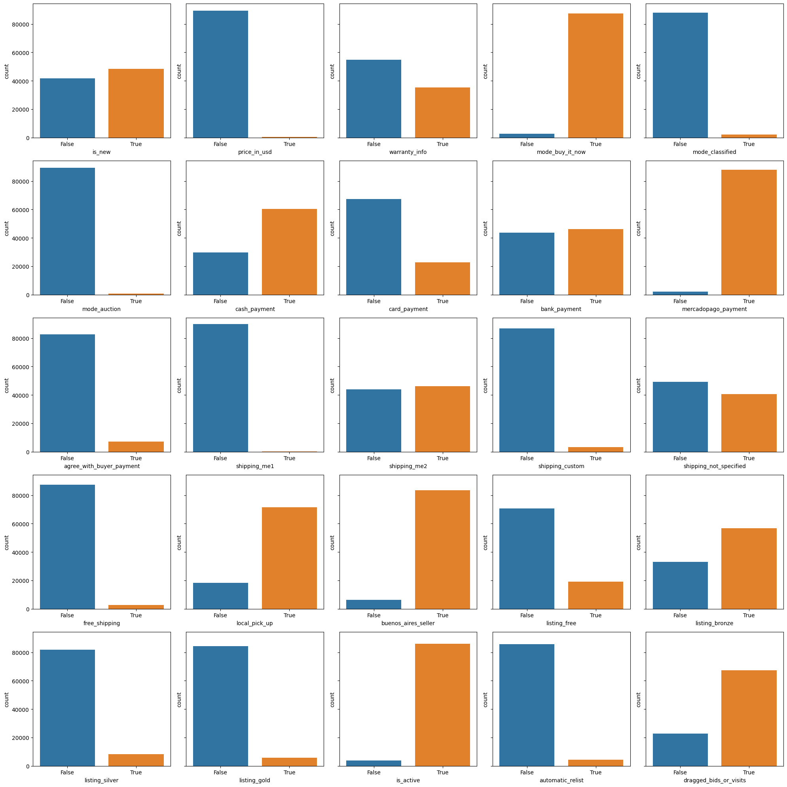

--------
The generated heatmap, produced by the boolean_correlation_heatmap_function(), illustrates the correlation between two boolean columns within a dataset. It represents a correlation matrix where each cell corresponds to a pair of states from the two boolean variables. It facilitates the identification of patterns and relationships between them within the dataset.

Interpretation:

- Higher values signify a higher proportion of cases where both boolean variables share the same state, implying a stronger correlation.
- Lower values indicate a weaker correlation between the states of the two variables.

Is sensitive to data imbalance.

```python
def boolean_correlation_heatmap_function(ax, data, column_1, column_2=None,**kwargs):
    """
    Create a heatmap subplot showing the correlation between two boolean columns.

    Parameters:
        ax (matplotlib.axes.Axes): The subplot axis to draw the heatmap.
        data (pandas.DataFrame): The DataFrame containing the data.
        column_1 (str): The name of the first boolean column.
        column_2 (str): The name of the second boolean column.

    Returns:
        None
    """
    if column_2 is None:
        column_2 = kwargs.pop('column_2', None)
    if column_2 is None:
        raise ValueError("The 'column_2' keyword argument is missing.")
    df = data

    case_1_counts = df[(df[column_1] == False) & (df[column_2] == False)].shape[0]
    case_2_counts = df[(df[column_1] == False) & (df[column_2] == True)].shape[0]
    case_3_counts = df[(df[column_1] == True) & (df[column_2] == False)].shape[0]
    case_4_counts = df[(df[column_1] == True) & (df[column_2] == True)].shape[0]

    column_1_true_count = df[column_1].sum()
    column_1_false_count = df.shape[0] - column_1_true_count
    column_2_true_count = df[column_2].sum()
    column_2_false_count = df.shape[0] - column_2_true_count

    case_1_percentage = (case_1_counts / column_1_false_count) * (case_1_counts / column_2_false_count) * 100
    case_2_percentage = (case_2_counts / column_1_false_count) * (case_2_counts / column_2_true_count) * 100
    case_3_percentage = (case_3_counts / column_1_true_count) * (case_3_counts / column_2_false_count) * 100
    case_4_percentage = (case_4_counts / column_1_true_count) * (case_4_counts / column_2_true_count) * 100

    correlation_matrix = pd.DataFrame([[case_1_percentage, case_2_percentage],
                                       [case_3_percentage, case_4_percentage]],
                                      index=[False, True], columns=[False, True])

    sns.heatmap(correlation_matrix, annot=True, cmap='RdBu', fmt='.1f', cbar=False, vmin=0, vmax=100, ax=ax,**kwargs)

    ax.set_xlabel(column_2)
    ax.set_ylabel(column_1)
    ax.set_title(f'{column_1} | {column_2}')
```
--------
```python
create_subplots(boolean_correlation_heatmap_function, df, target_column + bool_columns, num_rows=5, num_cols=5, title="", fig_size=(20, 20),share_y=True, column_2="is_new")
```
*Output:*

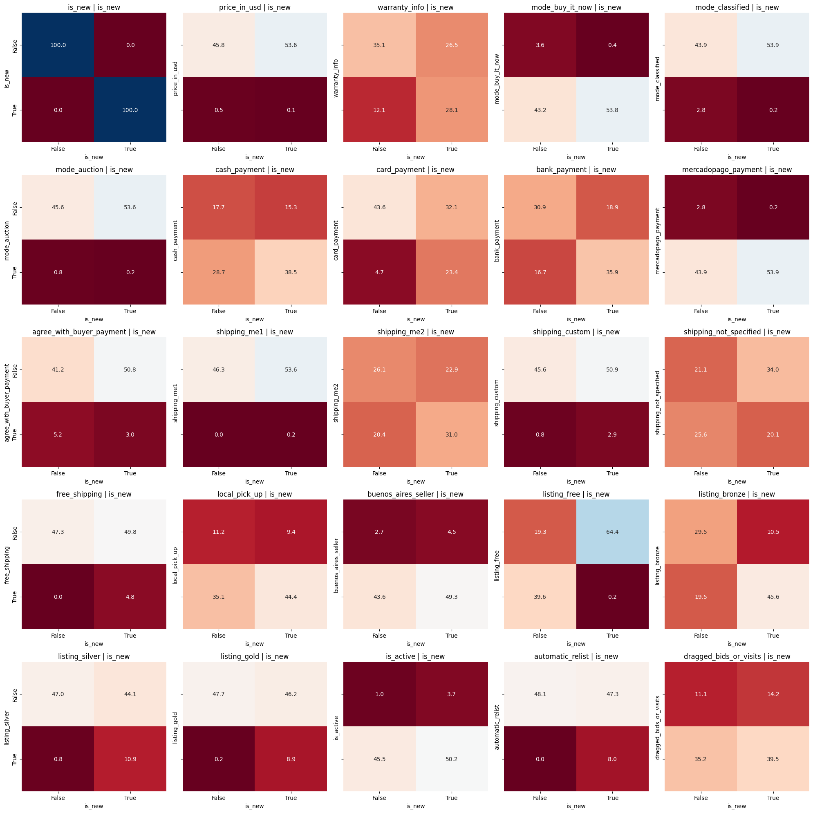

--------

### 3.2.2 Numeric columns
--------
```python
df[numeric_columns].describe()
```
*Output:*

```
|            | price       | initial_quantity | sold_quantity | available_quantity | days_active | num_pictures |
|------------|-------------|------------------|---------------|--------------------|-------------|--------------|
| count      | 9.000000e+04| 90000.000000     | 90000.000000  | 90000.000000       | 90000.000000| 90000.000000 |
| mean       | 5.781352e+04| 34.957178        | 2.328044      | 34.700767          | 60.924078  | 2.930322     |
| std        | 9.089555e+06| 421.091981       | 33.839328     | 420.811703         | 38.226420  | 2.104230     |
| min        | 8.400000e-01| 1.000000         | 0.000000      | 1.000000           | 0.000000   | 0.000000     |
| 25%        | 9.000000e+01| 1.000000         | 0.000000      | 1.000000           | 60.000000  | 1.000000     |
| 50%        | 2.500000e+02| 1.000000         | 0.000000      | 1.000000           | 60.000000  | 2.000000     |
| 75%        | 8.000000e+02| 2.000000         | 0.000000      | 2.000000           | 60.000000  | 4.000000     |
| max        | 2.222222e+09| 9999.000000      | 6065.000000   | 9999.000000        | 3457.000000| 36.000000    |

```
--------
```python
def boxplot_function(ax, data, class_label,**kwargs):
    """
    Create a boxplot on the given subplot axis using the provided DataFrame.

    Parameters:
        ax (matplotlib.axes.Axes): The subplot axis to draw the boxplot.
        data (pandas.Series or pandas.DataFrame): The data for the boxplot.
        class_label (str): The label for the class corresponding to the data.
        **kwargs: Arbitrary keyword arguments to pass to seaborn.boxplot.

    Returns:
        None
    """
    sns.boxplot(data=data[class_label], ax=ax,**kwargs)
    ax.set_xlabel(class_label)
```
--------
```python
create_subplots(boxplot_function, df, numeric_columns, num_rows=2, num_cols=3, title="Initial Boxplot", fig_size=(15, 10))
```
*Output:*

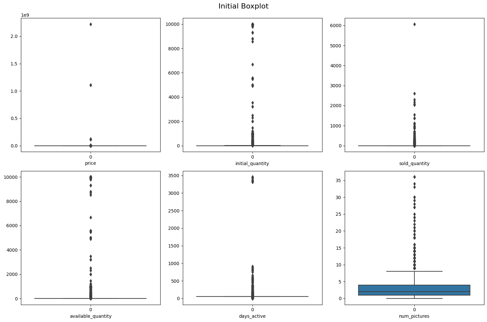

--------
```python
def histogram_function(ax, data, class_label,**kwargs):
    """
    Create a histogram on the given subplot axis using the provided DataFrame.

    Parameters:
        ax (matplotlib.axes.Axes): The subplot axis to draw the histogram.
        data (pandas.Series or pandas.DataFrame): The data for the histogram.
        class_label (str): The label for the class corresponding to the data.
        **kwargs: Arbitrary keyword arguments to pass to seaborn.histplot.

    Returns:
        None
    """
    sns.histplot(data=data[class_label], ax=ax,**kwargs)
    ax.set_xlabel(class_label)
```
--------
```python
create_subplots(histogram_function, df, numeric_columns, num_rows=2, num_cols=3, title="Initial Histogram", fig_size=(15, 10),share_y=True, bins=50, kde=False)
```
*Output:*

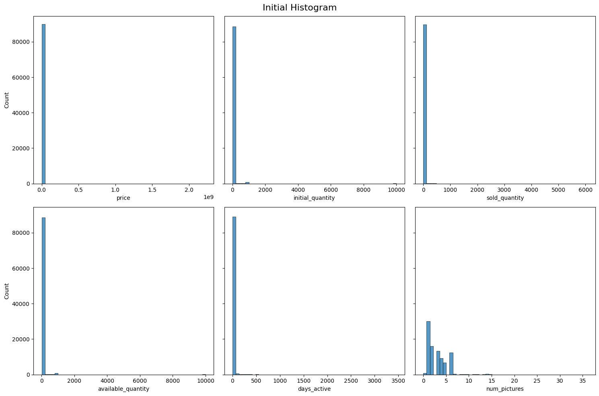

--------

We will construct a correlation matrix for the numerical columns to identify potential multicollinearity issues. This matrix provides insights into the strength and direction of linear relationships between pairs of variables, aiding in the detection of highly correlated features which may adversely affect certain analyses, such as regression models.

```python
def plot_correlation_matrix(df, columns, fig_size=(10, 8), **kwargs):
    """
    Plot the correlation matrix for specified columns of a DataFrame.

    Parameters:
        df (pandas.DataFrame): The DataFrame containing the data.
        columns (list): A list of column names to include in the correlation matrix.
        fig_size (tuple, optional): The size of the figure (width, height) in inches. Default is (10, 8).
        **kwargs: Additional keyword arguments to pass to sns.heatmap().

    Returns:
        None
    """
    correlation_matrix = df[columns].corr()

    if 'cmap' in kwargs:
        cmap = kwargs.pop('cmap')
    else:
        cmap = 'coolwarm'

    plt.figure(figsize=fig_size)
    sns.heatmap(correlation_matrix, annot=True, cmap=cmap, fmt=".2f", linewidths=0.5, vmax=1, vmin=-1, **kwargs)
    plt.title('Correlation Matrix')
    plt.show()
```

--------
```python
plot_correlation_matrix(df, numeric_columns)
```
*Output:*

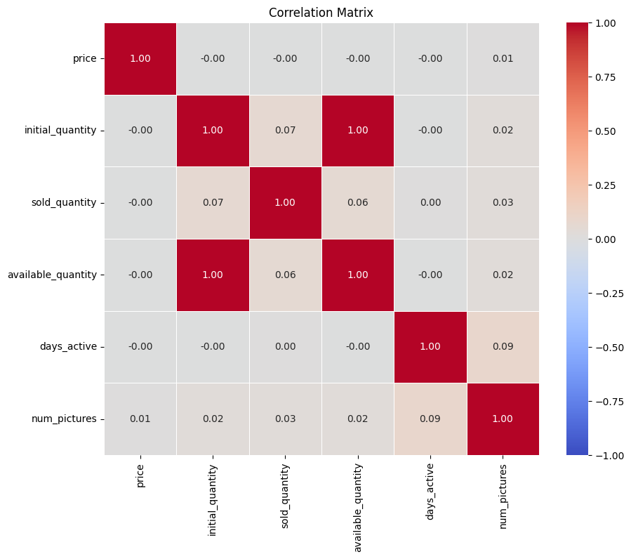

--------

we observed a strong correlation only between 'initial_quantity' and 'available_quantity.' This correlation is primarily attributed to instances where the product remains unsold at the time of data evaluation. However, for the remaining variables, no significant correlations were observed, indicating independence among most features.

### 3.2.3 Date columns
For the variable 'start_week', the distribution is concentrated between weeks 32 and 42, while for the variable 'stop_week', the concentration lies between weeks 43 and 52.

--------
```python
create_subplots(histogram_function, df, ['start_week','stop_week'], num_rows=1, num_cols=2, title="Week Data Histogram", fig_size=(10, 5),share_y=True, bins=52, kde=False)
```
*Output:*

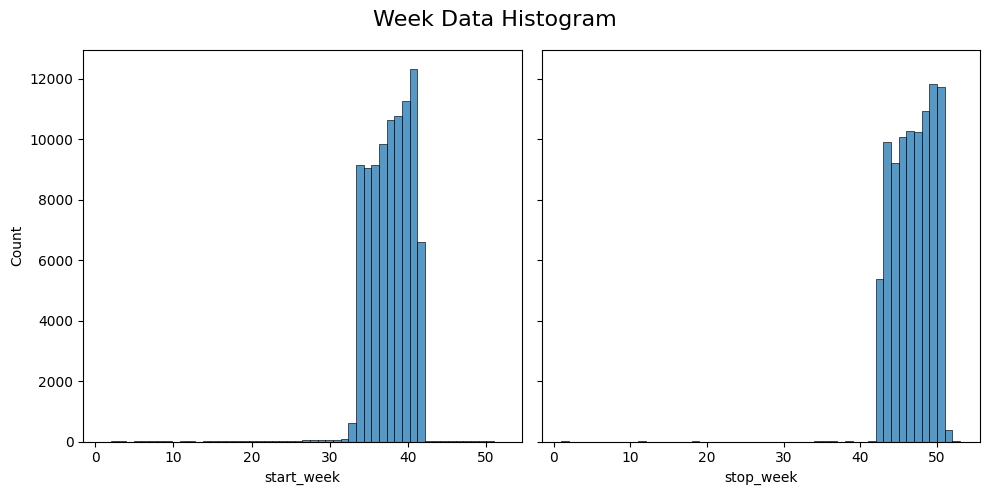

--------
Regarding 'start_day', its distribution is predominantly concentrated within the initial days of the week, exhibiting contrasting behavior to 'stop_day', where the concentration shifts towards later days of the week.

--------
```python
create_subplots(histogram_function, df, ['start_day','stop_day'], num_rows=1, num_cols=2, title="Weekday Data Histogram", fig_size=(10, 5),share_y=True, bins=7, kde=False)
```
*Output:*

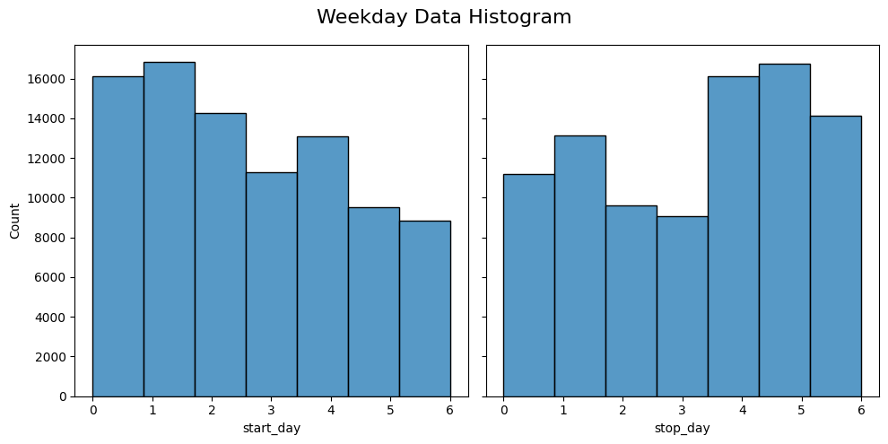

--------

### 3.2.4 Outlier detection
The detection of outliers in numerical columns will focus on three key features: 'price', 'days_active', 'initial_quantity', 'sold_quantity' and 'pictures'. 'available_quantity' will not be evaluated directly as it is dependent on 'initial_quantity'. This approach ensures a focused analysis on the core attributes while considering the interdependence among related features.

#### 3.2.4.1 days_active
--------
```python
print(f"Range days_active: {df['days_active'].min()} - {df['days_active'].max()}")
plot_percentile_range(df,"days_active",0)
```
*Output:*

Range days_active: 0 - 3457
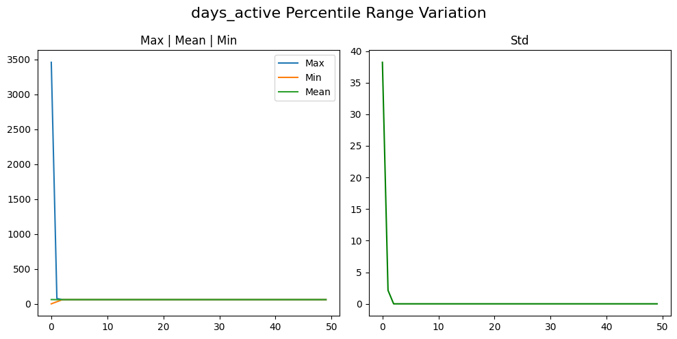

--------

For the variable 'days_active', it is noteworthy that while the data range spans from 0 to 3457, the majority of observations cluster below 100. We will delve deeper into the distribution within the range between different range of percentiles to gain insights into the prevailing trends.

--------
```python
days_active_range = 5
days_active_slice = percentile_range_data(df["days_active"],0+days_active_range,100-days_active_range)
print(f"Range days_active p{0+days_active_range} - p{100-days_active_range} : {days_active_slice.min()} - {days_active_slice.max()}")
print(f"Number of observations: {len(days_active_slice)}")
plot_percentile_range(df,"days_active",1)
```
*Output:*

Range days_active p5 - p95 : 60 - 60
Number of observations: 87101
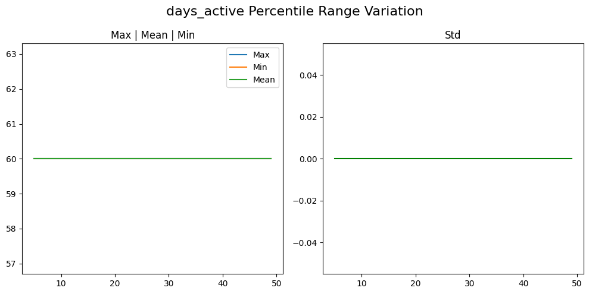

--------

Upon analyzing only the values falling within the range of the 5th to 95th percentiles, the 'days_active' variable is observed to be solely 60.

#### 3.2.4.2 price
--------
```python
print(f"Range price: {df['price'].min()} - {df['price'].max()}")
plot_percentile_range(df,"price",0,log_scale=True)
```
*Output:*

Range price: 0.84 - 2222222222.0
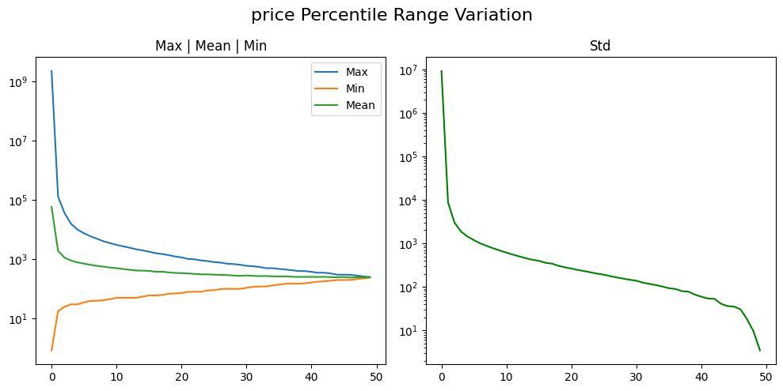

--------

For the variable 'price', it is noteworthy that while the data range spans from 0.84 to 2,222,222,222 the majority of observations cluster below 10000. We will delve deeper into the distribution within the range between different range of percentiles to gain insights into the prevailing trends.

--------
```python
price_range = 2
price_slice = percentile_range_data(df["price"],0+price_range,100-price_range)
print(f"Range price p{0+price_range} - p{100-price_range} : {price_slice.min()} - {price_slice.max()}")
print(f"Number of observations: {len(price_slice)}")
plot_percentile_range(df,"price",price_range,log_scale=True)
```
*Output:*

Range price p2 - p98 : 24.99 - 36000.0
Number of observations: 86429
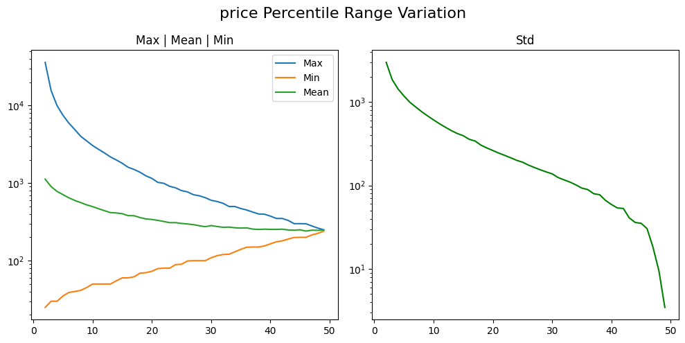

--------

Upon analyzing the data, it has been observed that a substantial portion, precisely 96%, of the dataset lies within a fairly compact range spanning from 24.99 to 36000. This indicates a concentrated distribution of values within this interval, suggestive of a coherent pattern or prevailing behavior within the dataset.

#### 3.2.4.3 initial_quantity

--------
```python
print(f"Range initial_quantity: {df['initial_quantity'].min()} - {df['initial_quantity'].max()}")
plot_percentile_range(df,"initial_quantity",0,log_scale=True)
```
*Output:*

Range initial_quantity: 1 - 9999
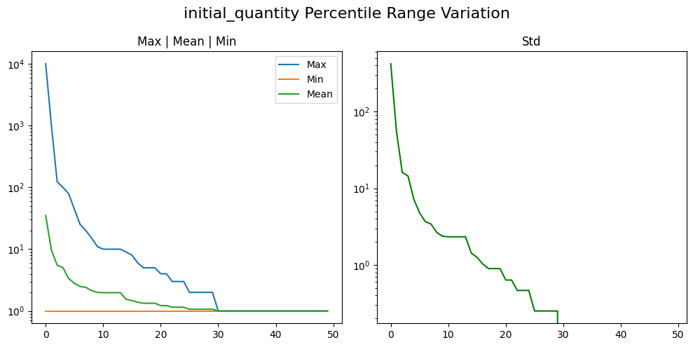

--------
For the variable 'available_quantity', it is noteworthy that while the data range spans from 1 to 9999 the majority of observations cluster below 100. We will delve deeper into the distribution within the range between different range of percentiles to gain insights into the prevailing trends.

--------
```python
initial_quantity_range = 4
initial_quantity_slice = percentile_range_data(df["initial_quantity"],0+initial_quantity_range,100-initial_quantity_range)
print(f"Range initial_quantity p{0+initial_quantity_range} - p{100-initial_quantity_range} : {initial_quantity_slice.min()} - {initial_quantity_slice.max()}")
print(f"Number of observations: {len(initial_quantity_slice)}")
plot_percentile_range(df,"initial_quantity",initial_quantity_range,log_scale=True)
```
*Output:*

Range initial_quantity p4 - p96 : 1 - 79
Number of observations: 86402
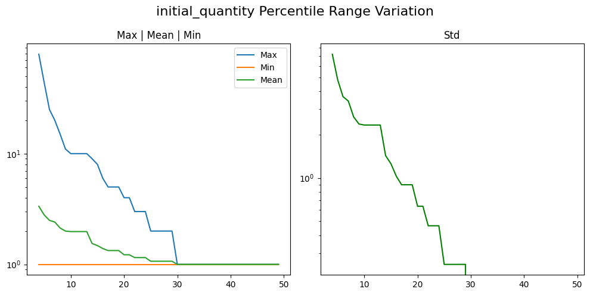

--------

Upon analyzing the variable "initial_quantity," it's apparent that 40% of the data is represented by a singular value of 1. Moreover, around 80% of the dataset falls within the range of 1 to 5 units, indicating a concentrated distribution. Additionally, the majority of observations (90%) vary between 1 and 10 units, while a significant portion (95%) spans from 1 to 50 units. Notably, a minority of observations (98%) extend from 1 to 150 units, suggesting the presence of outliers. These insights illuminate the variable's distributional nuances and potential impacts on analyses.

#### 3.2.4.4 sold_quantity
--------
```python
print(f"Range sold_quantity: {df['sold_quantity'].min()} - {df['sold_quantity'].max()}")
plot_percentile_range(df,"sold_quantity",0,log_scale=True)
```
*Output:*

Range sold_quantity: 0 - 6065
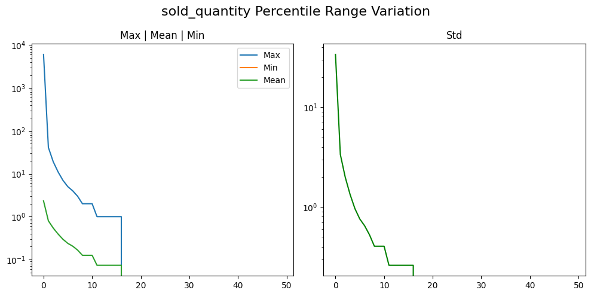

--------

For the variable 'sold_quantity', it is noteworthy that while the data range spans from 1 to 1540 the majority of observations cluster below 100. We will delve deeper into the distribution within the range between different range of percentiles to gain insights into the prevailing trends.

--------
```python
sold_quantity_range = 1
sold_quantity_slice = percentile_range_data(df["sold_quantity"],0+sold_quantity_range,100-sold_quantity_range)
print(f"Range sold_quantity p{0+sold_quantity_range} - p{100-sold_quantity_range} : {sold_quantity_slice.min()} - {sold_quantity_slice.max()}")
print(f"Number of observations: {len(sold_quantity_slice)}")
plot_percentile_range(df,"sold_quantity",sold_quantity_range,log_scale=True)
```
*Output:*

Range sold_quantity p1 - p99 : 0 - 41
Number of observations: 89108
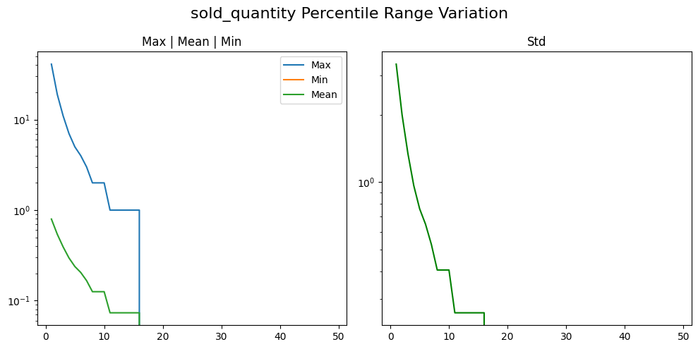

--------

Upon analyzing the variable "sold_quantity," it's apparent that 98% of the data is below 50.

#### 3.2.4.5 num_pictures

--------
```python
print(f"Range num_pictures: {df['num_pictures'].min()} - {df['num_pictures'].max()}")
plot_percentile_range(df,"num_pictures",0)
```
*Output:*

Range num_pictures: 0 - 36
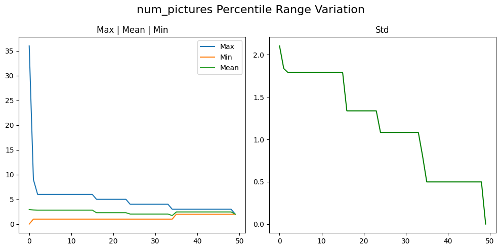

--------

For the variable 'num_pictures', the majority of observations cluster below 10. We will delve deeper into the distribution within the range between different range of percentiles to gain insights into the prevailing trends.

--------
```python
num_pictures_range = 1
num_pictures_slice = percentile_range_data(df["num_pictures"],0+num_pictures_range,100-num_pictures_range)
print(f"Range num_pictures p{0+num_pictures_range} - p{100-num_pictures_range} : {num_pictures_slice.min()} - {num_pictures_slice.max()}")
print(f"Number of observations: {len(num_pictures_slice)}")
plot_percentile_range(df,"num_pictures",num_pictures_range,)
```
*Output:*

Range num_pictures p1 - p99 : 1 - 9
Number of observations: 88429
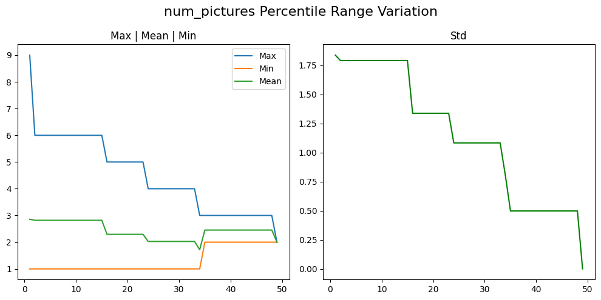

--------

Upon analyzing the variable 'pictures' it's apparent that 98% of the data is below 10.

### 3.2.5 Data Refinement and Outlier removal

Initially, we will discard columns exhibiting substantial imbalance as they predominantly offer redundant information that can be distilled from other columns, the "days_active" column, predominantly featuring a single value (60), will be eliminated. Additionally, we'll define operational bounds for "price" and "initial_quantity," facilitating a focused modeling approach within practical limits.

```python
columns_to_remove = ["price_in_usd", "mode_classified", "mode_auction", "shipping_me1", "days_active"]
price_threshold = 50000
initial_quantity_threshold = 150
sold_quantity_threshold = 150
available_quantity_threshold = 150
num_pictures_threshold = 10
df_list = [df,df_2]
for i in df_list:
    for column in columns_to_remove:
        i.drop(columns=[column], inplace=True)

    i.drop(i[i['price'] > price_threshold].index, inplace=True)
    i.drop(i[i['initial_quantity'] > initial_quantity_threshold].index, inplace=True)
    i.drop(i[i['sold_quantity'] > sold_quantity_threshold].index, inplace=True)
    i.drop(i[i['available_quantity'] > available_quantity_threshold].index, inplace=True)
    i.drop(i[i['num_pictures'] > num_pictures_threshold].index, inplace=True)
```
### 3.2.6 Skewness
Skewness is a statistical measure that indicates the asymmetry of a probability distribution around its mean. It quantifies the extent to which a distribution differs from a symmetric, bell-shaped curve. Understanding skewness is crucial as it provides valuable insights into the shape and behavior of data, aiding in making informed decisions and drawing accurate conclusions in statistical analysis. Addressing skewness is essential in data preprocessing to ensure that statistical models and analyses are robust and unbiased. In this step, we will undertake measures to address skewness and enhance the reliability and accuracy of our data analysis.
#### 3.2.6.1 initial
During this stage, a thorough analysis will be conducted on the following columns: price, initial_quantity, sold_quantity, available_quantity, and num_pictures

--------
```python
create_subplots(kdeplot_function, df, ['price','initial_quantity','sold_quantity','available_quantity'], num_rows=2, num_cols=2, title="Kdeplot", fig_size=(10, 10))
print(f"Skewness of price: {df['price'].skew():.2}")
print(f"Skewness of initial_quantity: {df['initial_quantity'].skew():.2}")
print(f"Skewness of sold_quantity: {df['sold_quantity'].skew():.2}")
print(f"Skewness of available_quantity: {df['available_quantity'].skew():.2}")
```
*Output:*

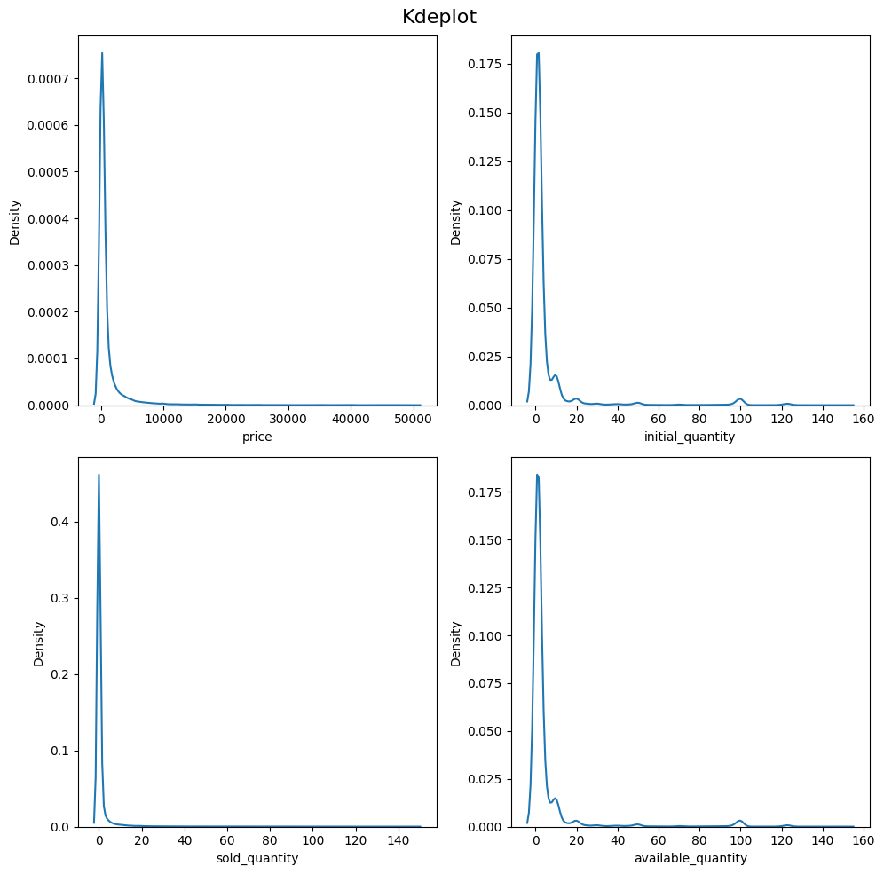


```
Skewness of price: 7.3 
Skewness of initial_quantity: 5.2
Skewness of sold_quantity: 1.1e+01
Skewness of available_quantity: 5.3
```
--------

```python
create_subplots(kdeplot_function, df, ['num_pictures'], num_rows=1, num_cols=1, title="Kdeplot", fig_size=(5, 5))
print(f"Skewness of num_pictures: {df['num_pictures'].skew():.2}")
```
*Output:*

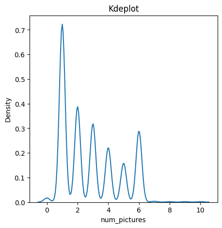


```
Skewness of num_pictures: 0.66
```
--------
The skewness analysis revealed notable disparities across the examined variables. Specifically, the skewness values for price, initial_quantity, sold_quantity, and available_quantity were found to be 7.3, 5.2, 11.0, and 5.3 respectively, indicating considerable asymmetry in their distributions. Conversely, the skewness value for num_pictures was observed to be 0.66, suggesting a relatively balanced distribution. Consequently, no corrective measures are deemed necessary for the num_pictures variable.

#### 3.2.6.2 log10
Initially, a logarithmic transformation using base 10 is applied to the dataset as part of the preprocessing phase. This transformation, known for its efficacy in addressing skewness. By employing this method, we aim to enhance the interpretability and reliability of our subsequent modeling and inference processes.

--------

```python
df_skew = df[['price','initial_quantity','sold_quantity','available_quantity']].copy(deep=True)

df_skew['price'] = np.log10(df_skew['price'])
df_skew['initial_quantity'] = np.log10(df_skew['initial_quantity'])
df_skew['sold_quantity'] = np.log10(df_skew['sold_quantity'])
df_skew['available_quantity'] = np.log10(df_skew['available_quantity'])

create_subplots(kdeplot_function, df_skew, ['price','initial_quantity','sold_quantity','available_quantity'], num_rows=2, num_cols=2, title="Kdeplot - log10", fig_size=(10, 10))
print(f"Skewness of price: {df_skew['price'].skew():.3}")
print(f"Skewness of initial_quantity: {df_skew['initial_quantity'].skew():.3}")
print(f"Skewness of sold_quantity: {df_skew['sold_quantity'].skew():.3}")
print(f"Skewness of available_quantity: {df_skew['available_quantity'].skew():.3}")
```
*Output:*

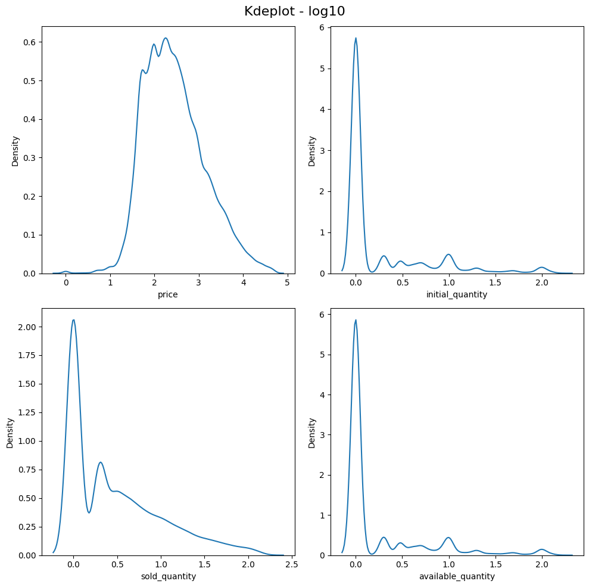


```
Skewness of price: 0.523
Skewness of initial_quantity: 2.01
Skewness of sold_quantity: nan
Skewness of available_quantity: 2.08
```
--------
Upon conducting skewness analysis, it was found that the price variable exhibited a skewness of 0.523, indicating a slight right skew. Initial_quantity and available_quantity displayed skewness values of 2.01 and 2.08 respectively, suggesting moderate positive skewness in their distributions. 

#### 3.2.6.3 yeojohnson

--------

```python
df_skew = df[['price','initial_quantity','sold_quantity','available_quantity']].copy(deep=True)

yj_price = -0.1326933439177492
yj_initial_quantity = -1.8163258668093907
yj_sold_quantity = -3.65996684652743
yj_available_quantity = -1.8854981114246059

df_skew['price'] = yeojohnson(df_skew['price'],yj_price)
df_skew['initial_quantity'] = yeojohnson(df_skew['initial_quantity'],yj_initial_quantity)
df_skew['sold_quantity'] = yeojohnson(df_skew['sold_quantity'],yj_sold_quantity)
df_skew['available_quantity'] = yeojohnson(df_skew['available_quantity'],yj_available_quantity)

create_subplots(kdeplot_function, df_skew, ['price','initial_quantity','sold_quantity','available_quantity'], num_rows=2, num_cols=2, title="Kdeplot - Yeojohnson", fig_size=(10, 10))
print(f"Skewness of price: {df_skew['price'].skew():.3}")
print(f"Skewness of initial_quantity: {df_skew['initial_quantity'].skew():.3}")
print(f"Skewness of sold_quantity: {df_skew['sold_quantity'].skew():.3}")
print(f"Skewness of available_quantity: {df_skew['available_quantity'].skew():.3}")
```
*Output:*

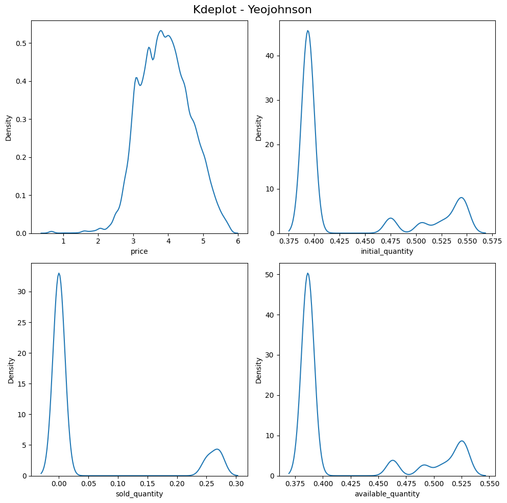


```
Skewness of price: 0.014
Skewness of initial_quantity: 1.09
Skewness of sold_quantity: 1.8
Skewness of available_quantity: 1.12
```
--------
We've decided to implement the Yeo-Johnson transformation as a corrective measure for the observed skewness. The Yeo-Johnson transformation offers a versatile alternative to conventional methods such as logarithmic or square root transformations. By applying the Yeo-Johnson transformation, we anticipate achieving a more symmetrical distribution, thereby enhancing the robustness of our subsequent analyses and improving model performance.

### 3.2.7 Scale and Normalize
```python
for i in range(len(df_list)):
    df_list[i]['price'] = yeojohnson(df_list[i]['price'], yj_price)
    df_list[i]['initial_quantity'] = yeojohnson(df_list[i]['initial_quantity'], yj_initial_quantity)
    df_list[i]['sold_quantity'] = yeojohnson(df_list[i]['sold_quantity'], yj_sold_quantity)
    df_list[i]['available_quantity'] = yeojohnson(df_list[i]['available_quantity'], yj_available_quantity)
```

Below is an overview of the data scaling process facilitated by a series of custom transformers:

- WeekScaler: This transformer scales weeks in the year to a range between 0 and 1, offering flexibility in handling temporal data.
- WeekdayScaler: Similar to WeekScaler, this transformer scales days of the week to a range from 0 to 1, facilitating uniform treatment of temporal variables.
- OneHotScaler: Designed for handling one-hot encoded variables, this transformer maintains data integrity by leaving such variables unchanged.
- DataScaler: This class orchestrates the scaling process by leveraging the aforementioned transformers within a predefined pipeline. Columns designated for standardization, min-max scaling, week scaling, weekday scaling, and one-hot encoding are organized and transformed accordingly.

Users are encouraged to explore the implementation of `DataScaler()` provided code, located at path `src/features/data_process.py`, to gain a deeper understanding of the intricacies involved in data scaling and transformation.

```python
scaler = DataScaler()
X_train_scaled = df.drop(columns=['is_new']).copy(deep=True)
y_train_scaled = df[['is_new']].copy(deep=True)
X_test_scaled = df_2.drop(columns=['is_new']).copy(deep=True)
y_test_scaled = df_2[['is_new']].copy(deep=True)

X_train_scaled = scaler.fit_transform(X_train_scaled)
X_test_scaled = scaler.transform(X_test_scaled)
```
The processed data will be stored securely to ensure its integrity and accessibility for future analyses.
```python
X_train_scaled.to_csv("../data/processed/train_data.csv", index=False)
y_train_scaled.to_csv("../data/processed/train_target.csv", index=False)
X_test_scaled.to_csv("../data/processed/test_data.csv", index=False)
y_test_scaled.to_csv("../data/processed/test_target.csv", index=False)
```
Furthermore, to streamline the data processing task, an implementation of the function `process_dataset()` has been developed and is located at path `src/features/data_process.py`. This function encapsulates all necessary steps for data processing, including scaling, encoding, and transformation, thereby simplifying the overall workflow and enhancing efficiency.

# 4. Models
## 4.1 Model Construction Overview
In this section, we provide an overview of the functions used to construct and evaluate various models, aiming to simplify the understanding of the model-building process. We'll present a brief explanation of each function to ensure clarity and ease of comprehension. This approach will streamline the model evaluation process by separating it from the detailed code implementation.

### 4.1.1 import_data()
The function `import_data()` imports training and testing data from CSV files and returns them as pandas DataFrames.
```python
def import_data():
    """
    Import data for training and testing.

    Args:

    Returns:
    - X_train (DataFrame): Training data features.
    - y_train (DataFrame): Training data labels.
    - X_test (DataFrame): Testing data features.
    - y_test (DataFrame): Testing data labels.
    """

    X_train = pd.read_csv(f"../data/processed/train_data.csv")
    y_train = pd.read_csv(f"../data/processed/train_target.csv")

    X_test = pd.read_csv(f"../data/processed/test_data.csv")
    y_test = pd.read_csv(f"../data/processed/test_target.csv")

    return X_train, y_train, X_test, y_test
```
### 4.1.2 find_best_threshold()
The function `find_best_threshold()` calculates the best threshold on the ROC curve by maximizing the difference between true positive rate (tpr) and false positive rate (fpr). It then returns this optimal threshold along with the corresponding accuracy score.
```python
def find_best_threshold(fpr, tpr, thresholds, y_test, y_prob):
    """
    Find the best threshold on ROC curve.

    Args:
        fpr (array-like): Array containing the false positive rates.
        tpr (array-like): Array containing the true positive rates.
        thresholds (array-like): Array containing the thresholds.
        y_test (array-like): Array containing true labels.
        y_prob (array-like): Array containing predicted probabilities.

    Returns:
        float: Best threshold and corresponding maximizing accuracy.
    """
    best_threshold = thresholds[np.argmax(tpr - fpr)]
    y_pred = np.where(y_prob >= best_threshold, 1, 0)
    y_test = np.squeeze(y_test)
    accuracy = accuracy_score(y_test, y_pred)
    return best_threshold, accuracy
```
### 4.1.3 plot_roc_curve_and_accuracy()
The `plot_roc_curve_and_accuracy()` function plots the ROC curve with the AUC value and the accuracy versus threshold.
```python
def plot_roc_curve_and_accuracy(fpr, tpr, auc, thresholds, y_test, y_prob, title="",title_font_size=16):
    """
    Plot ROC curve and accuracy vs. threshold.

    Parameters:
        fpr (array-like): Array containing the false positive rates.
        tpr (array-like): Array containing the true positive rates.
        auc (float): Area under the ROC curve (AUC) value.
        thresholds (array-like): Array containing the thresholds.
        y_test (array-like): Array containing true labels.
        y_prob (array-like): Array containing predicted probabilities.

    Returns:
        None (displays the plot).
    """
    plt.figure(figsize=(12, 5))
    plt.suptitle(title, fontsize=title_font_size) 
    
    plt.subplot(1, 2, 1)
    plt.plot(fpr, tpr, lw=2, label='ROC curve (AUC = %0.2f)' % auc)
    plt.plot([0, 1], [0, 1], color='gray', linestyle='--')
    plt.xlabel('False Positive Rate')
    plt.ylabel('True Positive Rate')
    plt.title('Receiver Operating Characteristic (ROC) Curve')
    plt.legend(loc="lower right")

    best_threshold, best_accuracy = find_best_threshold(fpr, tpr, thresholds, y_test, y_prob)
    accuracies = [accuracy_score(y_test, np.where(y_prob >= th, 1, 0)) for th in thresholds]
    plt.subplot(1, 2, 2)
    plt.plot(thresholds, accuracies, color='blue', lw=2, label='Accuracy')
    plt.axvline(x=best_threshold, color='red', linestyle='--', label='Best Threshold')
    plt.xlabel('Threshold')
    plt.ylabel('Accuracy')
    plt.title('Accuracy vs. Threshold')
    plt.legend(loc="lower right")

    plt.ylim(0, 1)
    plt.yticks(np.arange(0, 1.1, 0.1))
    plt.xlim(0, 1)
    plt.xticks(np.arange(0, 1.1, 0.1))

    text = f'Best Threshold: {best_threshold:.2f}\nBest Accuracy: {best_accuracy:.2f}'
    plt.text(0.05, 0.05, text, fontsize=10, transform=plt.gca().transAxes, bbox=dict(facecolor='white', alpha=0.5))

    plt.tight_layout()
    plt.show()
```
### 4.1.4 predict_classification()
The `predict_classification()` function predicts labels using a trained classification model and optionally prints evaluation metrics. It offers the flexibility to specify an optimal threshold for binary classification and returns the predicted labels.

```python
def predict_classification(model, X_test, y_test, optimal_threshold=0.5, print_results=False):
    """
    Predict labels using a classification model and optionally print evaluation metrics.

    Args:
        model (object): The trained classification model.
        X_test (array-like): Test features.
        y_test (array-like): True labels for the test set.
        optimal_threshold (float, optional): Threshold for binary classification. Default is 0.5.
        print_results (bool, optional): Whether to print evaluation metrics. Default is False.

    Returns:
        y_pred (array-like): Predicted labels.

    Prints:
        If print_results is True, evaluation metrics including Accuracy, F1 score, Precision, NVP, Sensitivity, and Specificity.
    """
    y_prob_test = model.predict_proba(X_test)[:, 1]
    y_pred = np.where(y_prob_test >= optimal_threshold, 1, 0)

    if print_results:
        accuracy_value = accuracy_score(y_test, y_pred)
        f1_score_value = f1_score(y_test, y_pred)
        precision_value = precision_score(y_test, y_pred)
        npv_value = npv_score(y_test, y_pred)
        sensitivity_value = recall_score(y_test, y_pred)
        specificity_value = specificity_score(y_test, y_pred)

        results = {
            "Accuracy": accuracy_value,
            "F1 score": f1_score_value,
            "Precision": precision_value,
            "NVP": npv_value,
            "Sensitivity": sensitivity_value,
            "Specificity": specificity_value
        }
        
        print("Evaluation metrics:")
        for metric, value in results.items():
            print(f"{metric:<12}:\t{value:.3f}")

    return y_pred
```
### 4.1.5 plot_confusion_matrix()

The `plot_confusion_matrix()` function generates a heatmap visualization of the confusion matrix based on true and predicted labels.

```python
def plot_confusion_matrix(y_true, y_pred, normalize=False, labels=None, show_colorbar=True):
    """
    Function to plot a confusion matrix.

    Args:
    - y_true: numpy array, true values.
    - y_pred: numpy array, predicted values.
    - normalize: bool, whether to normalize the confusion matrix or not.
    - labels: list of strings, labels for classes.
    - show_colorbar: bool, whether to show colorbar or not.
    """
    conf_matrix = confusion_matrix(y_true, y_pred)
    if labels is None:
        labels = np.unique(y_true)
    
    if normalize:
        conf_matrix = conf_matrix.astype('float') / conf_matrix.sum(axis=1)[:, np.newaxis]

    plt.figure(figsize=(8, 6))
    sns.set(font_scale=1.2)  

    sns.heatmap(conf_matrix, annot=True, fmt='.2f' if normalize else 'd', cmap='Blues', 
                xticklabels=labels, yticklabels=labels, vmin=0, vmax=1 if normalize else None, cbar=show_colorbar)

    plt.xlabel('Predicted Class')
    plt.ylabel('True Class')
    plt.title('Confusion Matrix')
    plt.show()
```


## 4.2 Logistic Regression
### 4.2.1 Import Libraries

```python
import pandas as pd
from sklearn.linear_model import LogisticRegression
from sklearn.model_selection import train_test_split
from sklearn.metrics import roc_curve, roc_auc_score
from src.features.functions import import_data,find_best_threshold, optimize_threshold_for_accuracy, predict_classification
from src.features.plots import plot_confusion_matrix,plot_roc_curve_and_accuracy
```
### 4.2.2 Import Data
```python
X_train, y_train, X_test, y_test = import_data()
```
### 4.2.3 Model Initialization and Fitting
```python
model = LogisticRegression()
model.fit(X_train, y_train)
```
### 4.2.4 Evaluation of ROC and AUC
```python
y_prob_val = model.predict_proba(X_val)[:, 1]
fpr, tpr, thresholds = roc_curve(y_val, y_prob_val)
auc = roc_auc_score(y_val, y_prob_val)
best_threshold, threshold_accuracy = find_best_threshold(fpr, tpr, thresholds, y_val, y_prob_val)
```
--------

```python
plot_roc_curve_and_accuracy(fpr, tpr, auc, thresholds, y_val, y_prob_val, "Logistic Regression - Validation data")
```
*Output:*

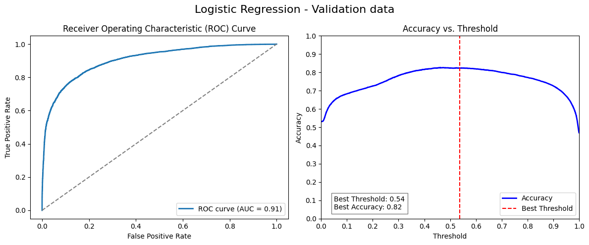

------------

```python
optimal_threshold, optimal_accuracy = optimize_threshold_for_accuracy(y_val, y_prob_val)
print(f"Optimal Threshold: {optimal_threshold:.3}, Accuracy: {optimal_accuracy:.3}")
```
*Output:*
```python
Optimal Threshold: 0.475, Accuracy: 0.826
```
------------
### 4.2.5 Evaluation of Performance Metrics
------------

```python
y_pred = predict_classification(model,X_test,y_test,optimal_threshold,True)
```
*Output:*
```python
Evaluation metrics:
Accuracy    :	0.831
F1 score    :	0.841
Precision   :	0.851
NVP         :	0.831
Sensitivity :	0.831
Specificity :	0.831
```
------------

### 4.2.6 Confusion Matrix
------------

```python
plot_confusion_matrix(y_test, y_pred,False,["Used","New"])
```
*Output:*


------------

## 4.3 Random Forest
### 4.3.1 Import Libraries

```python
import pandas as pd
from sklearn.ensemble import RandomForestClassifier
from sklearn.model_selection import train_test_split
from sklearn.metrics import roc_curve, roc_auc_score
from src.features.functions import import_data,find_best_threshold, optimize_threshold_for_accuracy, predict_classification
from src.features.plots import plot_confusion_matrix,plot_roc_curve_and_accuracy
```
### 4.3.2 Import Data
```python
X_train, y_train, X_test, y_test = import_data()
```
### 4.3.3 Model Initialization and Fitting
```python
model = RandomForestClassifier(n_estimators=100)
model.fit(X_train, y_train)
```
### 4.3.4 Evaluation of ROC and AUC
```python
y_prob_val = model.predict_proba(X_val)[:, 1]
fpr, tpr, thresholds = roc_curve(y_val, y_prob_val)
auc = roc_auc_score(y_val, y_prob_val)
best_threshold, threshold_accuracy = find_best_threshold(fpr, tpr, thresholds, y_val, y_prob_val)
```
--------

```python
plot_roc_curve_and_accuracy(fpr, tpr, auc, thresholds, y_val, y_prob_val, "XGBoost - Validation data")
```
*Output:*

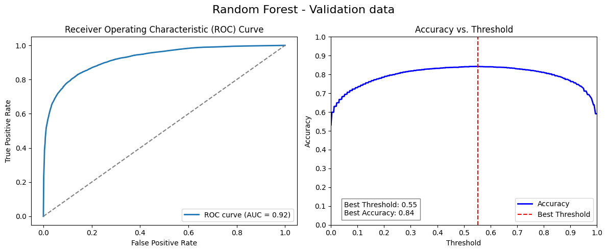

------------

```python
optimal_threshold, optimal_accuracy = optimize_threshold_for_accuracy(y_val, y_prob_val)
print(f"Optimal Threshold: {optimal_threshold:.3}, Accuracy: {optimal_accuracy:.3}")
```
*Output:*
```python
Optimal Threshold: 0.505, Accuracy: 0.842
```
------------
### 4.3.5 Evaluation of Performance Metrics
------------

```python
y_pred = predict_classification(model,X_test,y_test,optimal_threshold,True)
```
*Output:*
```python
Evaluation metrics:
Accuracy    :	0.843
F1 score    :	0.853
Precision   :	0.863
NVP         :	0.845
Sensitivity :	0.842
Specificity :	0.845
```
------------

### 4.3.6 Confusion Matrix
------------

```python
plot_confusion_matrix(y_test, y_pred,False,["Used","New"])
```
*Output:*


------------

## 4.4 XGBoost
### 4.4.1 Import Libraries

```python
import pandas as pd
import xgboost as xgb
from sklearn.model_selection import train_test_split
from sklearn.metrics import roc_curve, roc_auc_score
from src.features.functions import import_data,find_best_threshold, optimize_threshold_for_accuracy, predict_classification
from src.features.plots import plot_confusion_matrix,plot_roc_curve_and_accuracy
```
### 4.4.2 Import Data
```python
X_train, y_train, X_test, y_test = import_data()
```
### 4.4.3 Model Initialization and Fitting
```python
model = xgb.XGBClassifier(objective ='binary:logistic',)
model.fit(X_train, y_train)
```
### 4.4.4 Evaluation of ROC and AUC
```python
y_prob_val = model.predict_proba(X_val)[:, 1]
fpr, tpr, thresholds = roc_curve(y_val, y_prob_val)
auc = roc_auc_score(y_val, y_prob_val)
best_threshold, threshold_accuracy = find_best_threshold(fpr, tpr, thresholds, y_val, y_prob_val)
```
--------

```python
plot_roc_curve_and_accuracy(fpr, tpr, auc, thresholds, y_val, y_prob_val, "Random Forest - Validation data")
```
*Output:*

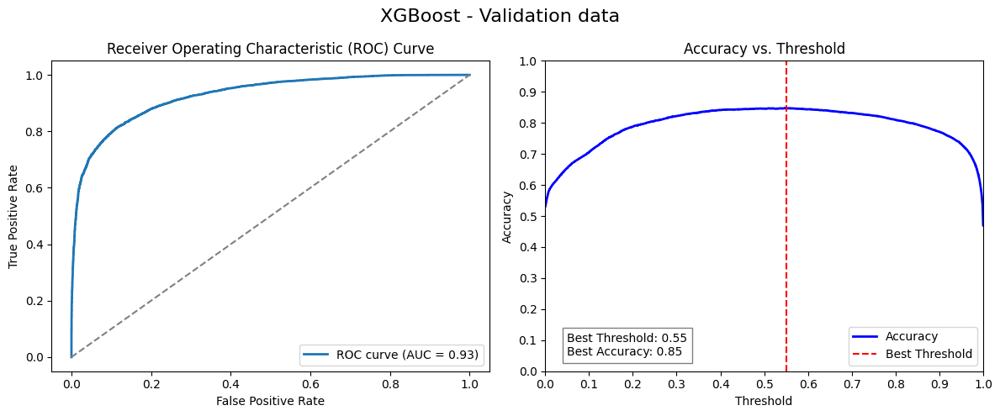

------------

```python
optimal_threshold, optimal_accuracy = optimize_threshold_for_accuracy(y_val, y_prob_val)
print(f"Optimal Threshold: {optimal_threshold:.3}, Accuracy: {optimal_accuracy:.3}")
```
*Output:*
```python
Optimal Threshold: 0.556, Accuracy: 0.847
```
------------
### 4.4.5 Evaluation of Performance Metrics
------------

```python
y_pred = predict_classification(model,X_test,y_test,optimal_threshold,True)
```
*Output:*
```python
Evaluation metrics:
Accuracy    :	0.851
F1 score    :	0.854
Precision   :	0.897
NVP         :	0.891
Sensitivity :	0.815
Specificity :	0.891
```
------------

### 4.4.6 Confusion Matrix
------------

```python
plot_confusion_matrix(y_test, y_pred,False,["Used","New"])
```
*Output:*

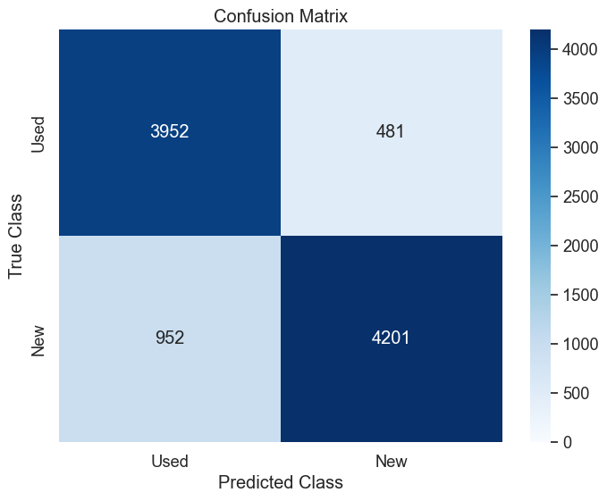

------------

## 4.5 Neural Network
### 4.5.1 Import Libraries

```python
import pandas as pd
from src.features.neural_networks import ModelFC, PyTorchWrapper
from sklearn.model_selection import train_test_split
from sklearn.metrics import roc_curve, roc_auc_score
from src.features.functions import import_data,find_best_threshold, optimize_threshold_for_accuracy, predict_classification
from src.features.plots import plot_confusion_matrix,plot_roc_curve_and_accuracy
```
### 4.5.2 Import Data
```python
X_train, y_train, X_test, y_test = import_data()
```
### 4.5.3 Model Initialization and Fitting
```python
model_torch = ModelFC(len(X_train.columns),len(y_train.columns),[8,8,8],0.5)
model = PyTorchWrapper(model_torch,num_epochs=10)
model.fit(X_train, y_train)
```
```python
model.model.plot_training()
```
*Output:*

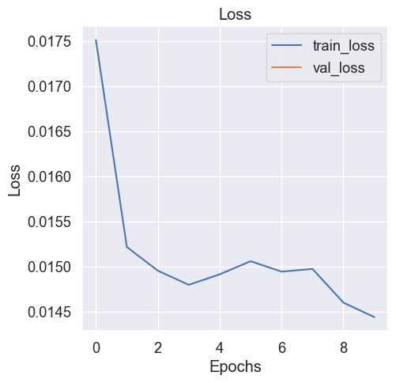

------------
### 4.5.4 Evaluation of ROC and AUC
```python
y_prob_val = model.predict_proba(X_val)[:, 1]
fpr, tpr, thresholds = roc_curve(y_val, y_prob_val)
auc = roc_auc_score(y_val, y_prob_val)
best_threshold, threshold_accuracy = find_best_threshold(fpr, tpr, thresholds, y_val, y_prob_val)
```
--------

```python
plot_roc_curve_and_accuracy(fpr, tpr, auc, thresholds, y_val, y_prob_val, "Neural Network - Validation data")
```
*Output:*

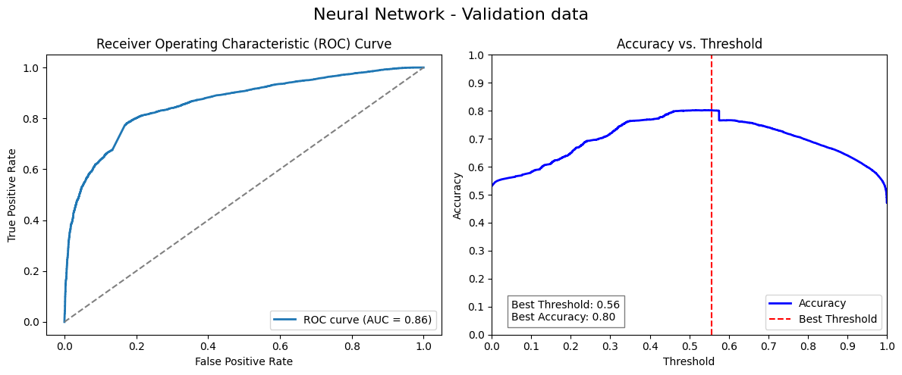

------------

```python
optimal_threshold, optimal_accuracy = optimize_threshold_for_accuracy(y_val, y_prob_val)
print(f"Optimal Threshold: {optimal_threshold:.3}, Accuracy: {optimal_accuracy:.3}")
```
*Output:*
```python
Optimal Threshold: 0.556, Accuracy: 0.802
```
------------
### 4.5.5 Evaluation of Performance Metrics
------------

```python
y_pred = predict_classification(model,X_test,y_test,optimal_threshold,True)
```
*Output:*
```python
Evaluation metrics:
Accuracy    :	0.806
F1 score    :	0.813
Precision   :	0.843
NVP         :	0.831
Sensitivity :	0.785
Specificity :	0.831
```
------------

### 4.5.6 Confusion Matrix
------------

```python
plot_confusion_matrix(y_test, y_pred,False,["Used","New"])
```
*Output:*

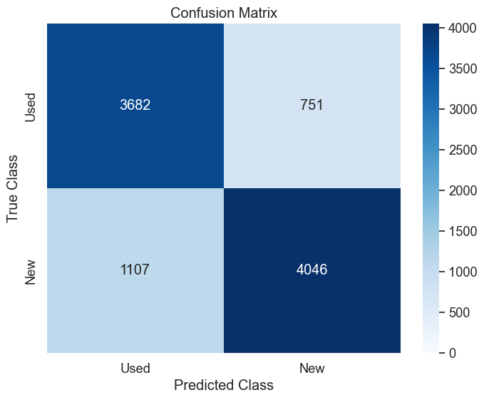

------------

## 4.6 Ensamble
### 4.6.1 Import Libraries

```python
import pandas as pd
import xgboost as xgb
import torch.optim as optim
from sklearn.linear_model import LogisticRegression
from sklearn.ensemble import RandomForestClassifier
from sklearn.ensemble import VotingClassifier
from src.features.neural_networks import ModelFC, PyTorchWrapper
from sklearn.model_selection import train_test_split
from sklearn.metrics import roc_curve, roc_auc_score
from src.features.functions import import_data,find_best_threshold, optimize_threshold_for_accuracy, predict_classification
from src.features.plots import plot_confusion_matrix,plot_roc_curve_and_accuracy
```
### 4.6.2 Import Data
```python
X_train, y_train, X_test, y_test = import_data()
```
### 4.6.3 Model Initialization and Fitting
------------
```python
logistic_regression_model = LogisticRegression()
random_forest_model = RandomForestClassifier(n_estimators=100)
xgboost_model =xgb.XGBClassifier()
torch_model = ModelFC(len(X_train.columns),len(y_train.columns),[8,8,8],0.5)
optimizer = optim.Adam(torch_model.parameters(),lr=0.001,weight_decay=0.001)
neural_network_model = PyTorchWrapper(torch_model,num_epochs=20)

model = VotingClassifier(estimators=[
    ('logistic_regression', logistic_regression_model),
    ('random_forest', random_forest_model),
    ('xgboost', xgboost_model),
    ('neural_network', neural_network_model),
], voting='soft')  

model.fit(X_train, y_train)
```
*Output:*

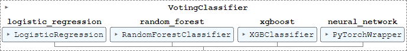

------------
### 4.6.4 Evaluation of ROC and AUC
```python
y_prob_val = model.predict_proba(X_val)[:, 1]
fpr, tpr, thresholds = roc_curve(y_val, y_prob_val)
auc = roc_auc_score(y_val, y_prob_val)
best_threshold, threshold_accuracy = find_best_threshold(fpr, tpr, thresholds, y_val, y_prob_val)
```
--------

```python
plot_roc_curve_and_accuracy(fpr, tpr, auc, thresholds, y_val, y_prob_val, "Random Forest - Validation data")
```
*Output:*

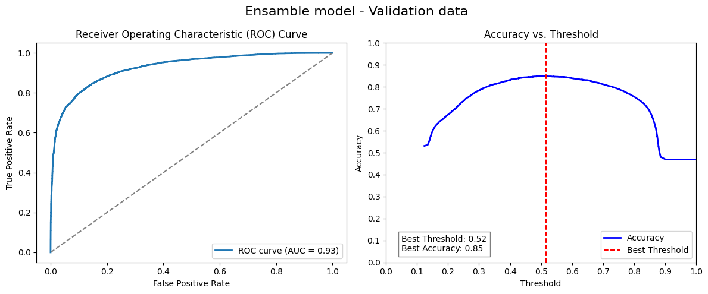

------------

```python
optimal_threshold, optimal_accuracy = optimize_threshold_for_accuracy(y_val, y_prob_val)
print(f"Optimal Threshold: {optimal_threshold:.3}, Accuracy: {optimal_accuracy:.3}")
```
*Output:*
```python
Optimal Threshold: 0.556, Accuracy: 0.847
```
------------
### 4.6.5 Evaluation of Performance Metrics
------------

```python
y_pred = predict_classification(model,X_test,y_test,optimal_threshold,True)
```
*Output:*
```python
Evaluation metrics:
Accuracy    :	0.854
F1 score    :	0.862
Precision   :	0.878
NVP         :	0.864
Sensitivity :	0.847
Specificity :	0.864
```
------------

### 4.6.6 Confusion Matrix
------------

```python
plot_confusion_matrix(y_test, y_pred,False,["Used","New"])
```
*Output:*

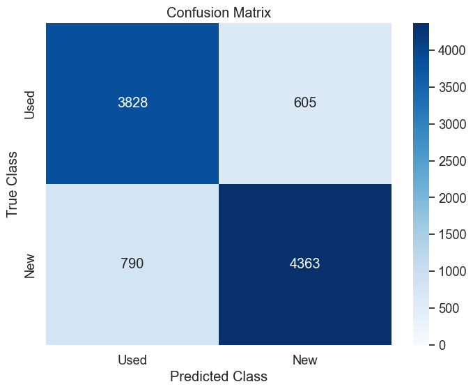

------------

# Appendix

## PuntualDataset

The `PuntualDataset` class is a custom dataset implementation designed for handling tabular data. It encapsulates the functionality required to prepare features and target data for training and inference in PyTorch models. The class converts input features and target data into torch tensors and provides methods to retrieve samples from the dataset by index

```python
class PuntualDataset(Dataset):
    """
    Custom dataset class for handling tabular data.

    This class encapsulates the functionality required to prepare tabular data for training and inference
    in PyTorch models.

    Args:
        X (array-like or DataFrame): Features data.
        y (array-like or Series): Target data.

    Attributes:
        X (Tensor): Features tensor converted to torch.float32.
        y (Tensor): Target tensor converted to torch.float32.
    """
    def __init__(self, X, y):
        if isinstance(X, np.ndarray):
            self.X = torch.tensor(X, dtype=torch.float32)
        else:
            self.X = torch.tensor(X.values, dtype=torch.float32)
        
        if isinstance(y, np.ndarray):
            self.y = torch.tensor(y, dtype=torch.float32)
        else:
            self.y = torch.tensor(y.values, dtype=torch.float32)
        
    def __len__(self):
        return len(self.X)
    
    def __getitem__(self, idx):
        return self.X[idx], self.y[idx]
```
## ModelFC
The `ModelFC` class represents a fully connected neural network model tailored for classification tasks. It is designed to accept input features and output predictions across a specified number of categories. This model architecture includes fully connected layers with optional dropout regularization. Additionally, it provides methods for training, validation, and plotting of training curves, enhancing its utility for model development and evaluation.
```python
class ModelFC(nn.Module):
    """
    Fully connected neural network model for classification.

    Args:
        input_size (int): Number of features.
        output_size (int): Number of categories.
        fc_hidden_sizes (list, optional): Number of hidden sizes per fully connected (fc) layer. Default is [1].
        fc_dropout (float, optional): Dropout probability after each fc layer. Default is 0.2.

    Attributes:
        name (str): Model name.
        input_size (int): Number of features.
        output_size (int): Number of categories.
        fc_hidden_sizes (list): Number of hidden sizes per fc layer.
        fc_dropout (float): Dropout probability after each fc layer.
        activation (torch.nn.Module): Activation function (Sigmoid).
        layers (torch.nn.Sequential): Sequential container for fc layers.

    Methods:
        forward(x): Forward pass through the model.
        train_validation(train_loader, val_loader, criterion, optimizer, num_epochs=10): Train and validate the model.
        train_model(train_loader, criterion, optimizer, num_epochs=10): Train the model.
        _train_step(train_loader, criterion, optimizer): Perform a single training step.
        _validation_step(val_loader, criterion): Perform a single validation step.
        plot_training(save_path=""): Plot training curves.

    """
    def __init__(self,
                 input_size, # Number of features
                 output_size, # Number of categories
                 fc_hidden_sizes=[1], # Number of hidden sizes per fc layer
                 fc_dropout=0.2, # Dropout probability after each fc layer
                 ):
        super(ModelFC, self).__init__()
        self.name = 'FC'
        self.device = DEVICE
        self.input_size = input_size
        self.output_size = output_size
        self.fc_hidden_sizes = fc_hidden_sizes
        self.fc_dropout = fc_dropout
        self.activation = nn.Sigmoid()

        layers = []

        fc_input_size = self.input_size
        for fc_hidden_size in self.fc_hidden_sizes:
            if fc_hidden_size <= 0:
                raise ValueError("hidden_size must be greater than 0")
            layers.append(nn.Linear(fc_input_size, fc_hidden_size))
            layers.append(nn.ReLU())
            layers.append(nn.Dropout(p=self.fc_dropout))
            fc_input_size = fc_hidden_size


        layers.append(nn.Linear(fc_input_size, self.output_size))
        self.layers = nn.Sequential(*layers)

    def forward(self, x):
        x = self.layers(x)
        x = self.activation(x)

        return x
        
    def train_validation(self, train_loader, val_loader, criterion, optimizer, num_epochs=10):
        self.to(self.device)

        results = {"train_loss": [],"val_loss": []}

        if not hasattr(self, "results"):
            setattr(self, "results", results)

        for epoch in range(num_epochs):
            start_time = timer() 
            train_loss = self._train_step(train_loader, criterion, optimizer)
            val_loss = self._validation_step(val_loader, criterion)
            end_time = timer()
            
            self.results["train_loss"].append(train_loss)
            self.results["val_loss"].append(val_loss)

            clear_output(wait=True)
            print(f'| Epoch [{epoch+1}/{num_epochs}] | Time: {end_time-start_time:.1f} |\n'
                  f'| Train Loss: {train_loss:.4f} | Val Loss: {val_loss:.4f} |\n')

            
            self.plot_training()

    def train_model(self, train_loader, criterion, optimizer, num_epochs=10):
        self.to(self.device)

        results = {"train_loss": [], "val_loss": []} 

        if not hasattr(self, "results"):
            setattr(self, "results", results)

        for _ in range(num_epochs):

            train_loss = self._train_step(train_loader, criterion, optimizer)
            val_loss = None

            self.results["train_loss"].append(train_loss)
            self.results["val_loss"].append(val_loss)


    def _train_step(self, train_loader, criterion, optimizer):
        self.train()  # Set the model to training mode

        running_loss = 0.0

        for inputs, labels in train_loader:
            inputs, labels = inputs.to(self.device), labels.to(self.device)

            optimizer.zero_grad()
            outputs = self(inputs)
            if outputs.size() != labels.size():
                outputs = outputs.squeeze()
            loss = criterion(outputs, labels)
            loss.backward()
            optimizer.step()

            running_loss += loss.item()

        epoch_loss = running_loss / len(train_loader.dataset)

        return epoch_loss

    def _validation_step(self, val_loader, criterion):
        self.eval()  # Set the model to evaluation mode

        running_loss = 0.0

        with torch.no_grad():
            for inputs, labels in val_loader:
                inputs, labels = inputs.to(self.device), labels.to(self.device)

                outputs = self(inputs)
                loss = criterion(outputs, labels)

                running_loss += loss.item()

        epoch_loss = running_loss / len(val_loader.dataset)

        return epoch_loss
    

    
    def plot_training(self, save_path: str = ""):
        """
        Plots training curves of a results dictionary.

        Args:
            results (dict): dictionary containing list of values, e.g.
                {"train_loss": [...],
                "val_loss": [...]}
            save_path (str): path to save the plot as PNG
        """
        results = self.results

        loss = results['train_loss']
        val_loss = results['val_loss']

        epochs = range(len(results['train_loss']))

        plt.figure(figsize=(5, 5))
        plt.plot(epochs, loss, label='train_loss')
        plt.plot(epochs, val_loss, label='val_loss')
        plt.title('Loss')
        plt.xlabel('Epochs')
        plt.ylabel('Loss')
        plt.legend()

        if save_path:
            plt.savefig(save_path)
        else:
            plt.show()
```

# PyTorchWrapper
The `PyTorchWrapper` class offers a versatile solution for seamlessly integrating PyTorch models into scikit-learn pipelines, specifically tailored for classification tasks. It simplifies training, prediction, and probability estimation processes.

```python
class PyTorchWrapper(BaseEstimator, ClassifierMixin):
    """
    A wrapper class for PyTorch models designed for classification tasks.

    Args:
        model (nn.Module): PyTorch model to be wrapped.
        criterion (torch.nn.Module, optional): Loss function used for optimization. Default is nn.BCELoss().
        optimizer (torch.optim.Optimizer, optional): Optimizer used for training. Default is Adam optimizer.
        learning_rate (float, optional): Learning rate for optimizer. Default is 0.001.
        weight_decay (float, optional): Weight decay (L2 penalty) for optimizer. Default is 0.001.
        num_epochs (int, optional): Number of training epochs. Default is 10.

    Attributes:
        model (nn.Module): PyTorch model to be wrapped.
        criterion (torch.nn.Module): Loss function used for optimization.
        learning_rate (float): Learning rate for optimizer.
        weight_decay (float): Weight decay (L2 penalty) for optimizer.
        optimizer_class (torch.optim.Optimizer): Optimizer class used for training.
        num_epochs (int): Number of training epochs.
        threshold (float): Threshold value for binary classification predictions.

    Methods:
        fit(X, y): Fit the model to the training data.
        predict(X): Generate class predictions for the input data.
        predict_proba(X): Generate probability estimates for class predictions.
    """
    def __init__(self, model, criterion=nn.BCELoss(), optimizer=None, learning_rate=0.001, weight_decay=0.001, num_epochs=10):
        self.model = model
        self.criterion = criterion
        self.learning_rate = learning_rate
        self.weight_decay = weight_decay
        self.optimizer_class = optimizer
        self.num_epochs = num_epochs
        self.threshold = 0.5
        if optimizer is None:
            self.optimizer = optim.Adam(self.model.parameters(), lr=self.learning_rate, weight_decay=self.weight_decay)
        else:
            self.optimizer = optimizer
            
    def fit(self, X, y):
        dataset = PuntualDataset(X, y)
        train_loader = DataLoader(dataset, batch_size=32, shuffle=True)

        self.model.train_model(train_loader, self.criterion, self.optimizer, self.num_epochs)
        return self

    def predict(self, X):
        device = self.model.device
        dataset = PuntualDataset(X, pd.Series([0] * len(X)))  
        data_loader = DataLoader(dataset, batch_size=32, shuffle=False)

        predictions = []
        with torch.no_grad():
            for inputs, _ in data_loader:
                inputs = inputs.to(device)
                outputs = self.model(inputs)
                predictions.extend(outputs.cpu().numpy())

        return (np.array(predictions) > self.threshold).astype(int)  

    def predict_proba(self, X):
        device = self.model.device
        dataset = PuntualDataset(X, pd.Series([0] * len(X)))  
        data_loader = DataLoader(dataset, batch_size=32, shuffle=False)

        probabilities = []
        with torch.no_grad():
            for inputs, _ in data_loader:
                inputs = inputs.to(device)
                outputs = self.model(inputs)
                probabilities.extend(outputs.cpu().numpy())

        probabilities = np.array(probabilities)
        return np.hstack((1 - probabilities, probabilities))
```